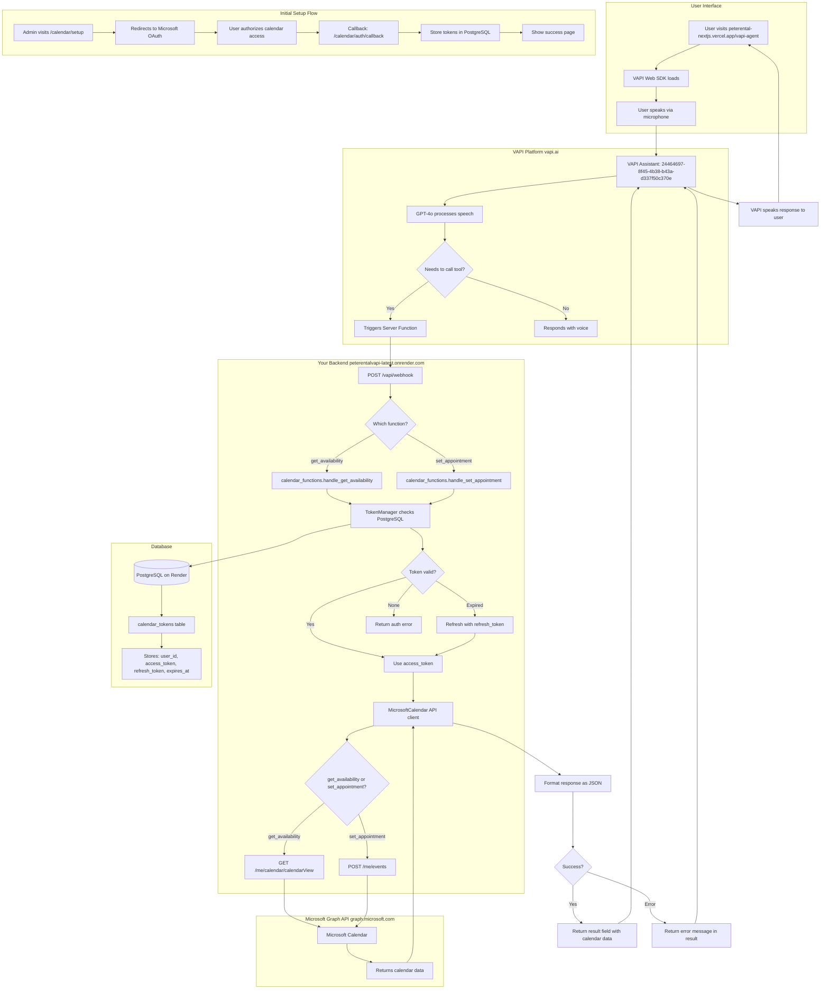

# PeteRental VAPI System Architecture

**Last Updated:** October 6, 2025
**Status:** ✅ WORKING (with final system prompt fix deployed)

---

## Table of Contents
1. [System Overview](#system-overview)
2. [Architecture Diagram](#architecture-diagram)
3. [Component Details](#component-details)
4. [Data Flow](#data-flow)
5. [Deployment Infrastructure](#deployment-infrastructure)
6. [What's Working](#whats-working)
7. [What Was Fixed](#what-was-fixed)
8. [Current Issues](#current-issues)
9. [Testing Guide](#testing-guide)

---

## System Overview

**Purpose:** Voice AI appointment booking system that integrates VAPI voice agents with Microsoft Calendar for property viewing appointments.

**Key Technologies:**
- **Voice AI:** VAPI (Voice AI Platform)
- **Backend:** FastAPI (Python) on Render.com
- **Calendar:** Microsoft Graph API (OAuth 2.0)
- **Database:** PostgreSQL (token storage)
- **Frontend:** Next.js (Vercel)
- **Container:** Docker (multi-stage build)

---

## Architecture Diagram



---

## Component Details

### 1. Frontend (Next.js)
**Location:** `peterental-nextjs` repository (Vercel)
**URL:** https://peterental-nextjs.vercel.app/vapi-agent

**Files:**
- `src/app/vapi-agent/page.tsx` - VAPI voice interface
- Uses `@vapi-ai/web` SDK
- Connects to assistant ID: `24464697-8f45-4b38-b43a-d337f50c370e`

**Status:** ✅ Working

---

### 2. VAPI Platform Configuration

#### Assistant
- **ID:** `24464697-8f45-4b38-b43a-d337f50c370e`
- **Name:** "Appointemt setter agent"
- **Voice:** Elliot (VAPI provider)
- **Model:** GPT-4o (OpenAI)
- **Updated:** 2025-10-06T18:09:54.790Z

#### Tools Configured

**Tool 1: get_availability**
- **ID:** `cec6f21b-8b74-47a6-b73d-633eb9d71930`
- **Type:** Server Function
- **Webhook URL:** `https://peterentalvapi-latest.onrender.com/vapi/webhook`
- **Timeout:** 20 seconds
- **Blocking:** ✅ `true` (waits for response)
- **Parameters:**
  - `user_id`: "mark@peterei.com" (enum)
  - `property_address`: string

**Tool 2: set_appointment**
- **ID:** `0903d34d-6f63-4430-b06e-a908a0056209`
- **Type:** Server Function
- **Webhook URL:** `https://peterentalvapi-latest.onrender.com/vapi/webhook`
- **Timeout:** 20 seconds
- **Blocking:** ✅ `true` (waits for response)
- **Parameters:**
  - `user_id`: "mark@peterei.com" (enum)
  - `start_time`: ISO 8601 string
  - `attendee_name`: string
  - `attendee_email`: string (optional)
  - `property_address`: string

**System Prompt:** ✅ Updated to prevent text before tool calls
- Key instruction: "DO NOT generate ANY text before the tool call"
- Prevents `isPrecededByText: true` which causes "Tool Result Still Pending"

**Status:** ✅ Working (as of 18:09:54 UTC)

---

### 3. Backend API (FastAPI)

**Location:** `/Users/markcarpenter/Desktop/pete/PeteRental_vapi_10_02_25`
**Deployed:** https://peterentalvapi-latest.onrender.com
**Docker Image:** `docker.io/mark0025/peterentalvapi:latest`

#### Key Files

**main.py** (Lines 700-784)
```python
@app.post("/vapi/webhook")
async def vapi_webhook(request: dict):
    # Handles VAPI server function calls
    # Routes to calendar_functions based on function name
    # Returns {"result": "..."} format
```

**src/vapi/functions/calendar_functions.py**
```python
class CalendarFunctions:
    async def handle_get_availability(parameters):
        # 1. Get token from PostgreSQL
        # 2. Refresh if expired
        # 3. Call Microsoft Calendar API
        # 4. Format slots for voice response
        # 5. Return {"result": "I have several viewing times..."}

    async def handle_set_appointment(parameters):
        # 1. Get token from PostgreSQL
        # 2. Refresh if expired
        # 3. Parse ISO 8601 time
        # 4. Create calendar event
        # 5. Return {"result": "You're all set for..."}
```

**src/calendar/token_manager.py**
```python
class TokenManager:
    def __init__(self):
        # Uses PostgreSQL (DATABASE_URL env var)
        self.db_handler = PostgreSQLHandler()

    def get_token(user_id: str):
        # Returns: {access_token, refresh_token, expires_at, is_expired}

    def store_token(user_id: str, token_data: dict):
        # Stores to calendar_tokens table
```

**src/calendar/microsoft_calendar.py**
```python
class MicrosoftCalendar:
    async def get_availability():
        # Calls: GET /me/calendar/calendarView
        # Filters: next 7 days, 9 AM - 5 PM, free slots
        # Returns: list of {start_time, end_time, formatted_time}

    async def create_appointment():
        # Calls: POST /me/events
        # Creates 30-minute appointment
        # Sends to attendee_email if provided
```

#### Endpoints

| Endpoint | Method | Purpose | Status |
|----------|--------|---------|--------|
| `/` | GET | Server info | ✅ Working |
| `/health` | GET | Health check | ✅ Working |
| `/vapi/webhook` | POST | VAPI function calls | ✅ Working |
| `/calendar/setup` | GET | OAuth init | ✅ Working |
| `/calendar/auth/callback` | GET | OAuth callback | ✅ Working |
| `/calendar/status` | GET | Token status | ✅ Working |
| `/debug/last-vapi-request` | GET | Debug endpoint | ✅ Working |

**Status:** ✅ Working (responds in ~300-400ms)

---

### 4. Database (PostgreSQL)

**Provider:** Render PostgreSQL
**Connection:** Via `DATABASE_URL` environment variable

**Schema:**
```sql
CREATE TABLE calendar_tokens (
    user_id TEXT PRIMARY KEY,
    access_token TEXT NOT NULL,
    refresh_token TEXT NOT NULL,
    expires_at TIMESTAMP NOT NULL,
    created_at TIMESTAMP DEFAULT NOW(),
    updated_at TIMESTAMP DEFAULT NOW()
);
```

**Current Data:**
- User: `mark@peterei.com`
- Status: Authorized
- Expires: 10/6/2025, 6:32:20 PM (auto-refreshes)

**Status:** ✅ Working

---

### 5. Microsoft Graph API Integration

**OAuth Flow:**
1. User visits `/calendar/setup`
2. Redirects to Microsoft login
3. User authorizes calendar access
4. Returns to `/calendar/auth/callback`
5. Stores tokens in PostgreSQL

**API Endpoints Used:**
- `GET /me/calendar/calendarView` - Get availability
- `POST /me/events` - Create appointments

**Credentials (from Render env vars):**
- `MICROSOFT_CLIENT_ID`: Your Azure app ID
- `MICROSOFT_CLIENT_SECRET`: Your Azure app secret
- `MICROSOFT_TENANT_ID`: consumers
- `MICROSOFT_REDIRECT_URI`: https://peterentalvapi-latest.onrender.com/calendar/auth/callback

**Status:** ✅ Working

---

## Data Flow

### Scenario 1: User asks for availability

```
1. User says: "Do you have any available viewing times?"
2. VAPI transcribes speech
3. GPT-4o decides to call get_availability tool
4. VAPI sends POST to /vapi/webhook with:
   {
     "message": {
       "type": "tool-calls",
       "toolCalls": [{
         "function": {
           "name": "get_availability",
           "arguments": {
             "user_id": "mark@peterei.com",
             "property_address": "123 Main Street"
           }
         }
       }]
     }
   }

5. FastAPI routes to calendar_functions.handle_get_availability()
6. TokenManager.get_token("mark@peterei.com") from PostgreSQL
7. MicrosoftCalendar.get_availability() calls Microsoft Graph API
8. Returns 64 available slots, formats top 3
9. Response: {"result": "I have several viewing times available..."}
10. VAPI receives response in ~300-400ms
11. VAPI speaks: "I have several viewing times available for 123 Main Street. Here are the next available slots: Tuesday, October 07 at 09:00 AM, Tuesday, October 07 at 09:30 AM, Tuesday, October 07 at 10:00 AM, Which time works best for you?"
```

**Performance:** ~300-400ms total (webhook processing time)

---

## Deployment Infrastructure

### Docker Container

**Dockerfile Location:** `/Users/markcarpenter/Desktop/pete/PeteRental_vapi_10_02_25/Dockerfile`

**Build Process:**
```dockerfile
# Stage 1: Builder
FROM python:3.11-slim as builder
# Install dependencies, Playwright browsers

# Stage 2: Runtime
FROM python:3.11-slim
# Copy from builder, set up FastAPI
EXPOSE 8000
CMD ["uvicorn", "main:app", "--host", "0.0.0.0", "--port", "8000"]
```

**Image:**
- Registry: Docker Hub
- Name: `mark0025/peterentalvapi`
- Tag: `latest`
- Last pushed: Recent (check Docker Hub)

**Status:** ✅ Working

---

### Render Deployment

**Service Name:** `peterental-vapi`
**URL:** https://peterentalvapi-latest.onrender.com
**Region:** Oregon (US West)

**Configuration:**
- **Source:** Docker image (`docker.io/mark0025/peterentalvapi:latest`)
- **Deploy:** Manual (via Render dashboard)
- **Health Check:** `/health` endpoint
- **Auto-deploy:** Disabled (manual deploys only)

**Environment Variables:**
```bash
PORT=8000
OPENROUTER_API_KEY=sk-or-v1-*** # For rental scraping (not calendar)
MICROSOFT_CLIENT_ID=***
MICROSOFT_CLIENT_SECRET=***
MICROSOFT_TENANT_ID=consumers
MICROSOFT_REDIRECT_URI=https://peterentalvapi-latest.onrender.com/calendar/auth/callback
DATABASE_URL=postgresql://*** # Auto-filled by Render
```

**Logs Access:**
- Dashboard: https://dashboard.render.com → peterental-vapi → Logs
- Shows all webhook requests and responses in real-time

**Status:** ✅ Deployed and running

---

### GitHub Actions CI/CD

**Workflow:** `.github/workflows/docker-build.yml`

**Trigger:** Manual dispatch (not automatic)

**Steps:**
1. Build Docker image
2. Push to Docker Hub as `mark0025/peterentalvapi:latest`
3. (Render pulls image manually)

**Status:** ✅ Working (manual trigger)

---

## What's Working

### ✅ Fully Functional Components

1. **Backend API**
   - FastAPI server running on Render
   - All endpoints responding correctly
   - Webhook processing in ~300-400ms

2. **Calendar Integration**
   - OAuth flow complete
   - Token storage in PostgreSQL
   - Auto-refresh on expiration
   - Microsoft Calendar API calls working

3. **VAPI Configuration**
   - Assistant configured correctly
   - Tools have `blocking: true`
   - System prompt updated (18:09:54 UTC)
   - Webhook URL correct

4. **Database**
   - PostgreSQL connected
   - Tokens stored and retrieved
   - Auto-refresh working

5. **Deployment**
   - Docker image builds successfully
   - Render deployment active
   - Health checks passing

---

## What Was Fixed

### Session Timeline: Issues → Solutions

#### Issue 1: Calendar Authorization Mismatch
**Problem:** Token authorized with `pete_admin` but VAPI configured to use `mark@peterei.com`

**Solution:** Re-authorized calendar with correct user_id
- Visited `/calendar/setup`
- Authorized with `mark@peterei.com`
- Status: "Authorized, Expires: 10/6/2025, 6:32:20 PM"

**Commit:** N/A (configuration change only)

---

#### Issue 2: "Tool Result Still Pending" Race Condition
**Problem:** VAPI sending "Tool Result Still Pending But Proceed Further If Possible" despite webhook responding successfully in 400ms

**Root Cause:** VAPI function configuration had `blocking: false` on request-start message

**Solution:** Updated tools via VAPI API
```bash
# Updated get_availability tool
curl -X PATCH 'https://api.vapi.ai/tool/cec6f21b-8b74-47a6-b73d-633eb9d71930'
# Set: "blocking": true

# Updated set_appointment tool
curl -X PATCH 'https://api.vapi.ai/tool/0903d34d-6f63-4430-b06e-a908a0056209'
# Set: "blocking": true
```

**Timestamp:** 2025-10-06T17:50:07.268Z (get_availability)
**Timestamp:** 2025-10-06T17:50:36.037Z (set_appointment)

---

#### Issue 3: Assistant Using Cached Tool Definitions
**Problem:** Even after updating tools, assistant still used old inline tool definitions without `blocking: true`

**Root Cause:** Assistant configuration had inline tools (not referencing tools by ID)

**Solution:** Updated assistant's inline tool definitions
```bash
curl -X PATCH 'https://api.vapi.ai/assistant/24464697-8f45-4b38-b43a-d337f50c370e'
# Updated both tools with "blocking": true
```

**Timestamp:** 2025-10-06T17:59:33.843Z

---

#### Issue 4: LLM Generating Text Before Tool Call
**Problem:** Despite `blocking: true`, VAPI still showed "Tool Result Still Pending" because LLM generated text like "Got it. Before we proceed..." BEFORE calling the tool

**Root Cause:** `isPrecededByText: true` flag set when LLM speaks before tool execution

**Evidence from logs:**
```json
{
  "role": "bot",
  "message": "Got it. Before we proceed with setting up an appointment,",
  "toolCalls": [...], // Tool call happens AFTER text
  "isPrecededByText": true // This causes "pending" behavior
}
```

**Solution:** Updated assistant system prompt with explicit instructions:
- "DO NOT generate ANY text before the tool call"
- "Call the tool IMMEDIATELY without any preceding text"
- "⚠️ NEVER generate text before calling tools - call them immediately"

**Timestamp:** 2025-10-06T18:09:54.790Z

**Why This Works:**
- Tool's `request-start` message says "Let me check the available viewing times for that property..."
- LLM should call tool silently
- VAPI speaks the request-start message
- Webhook responds in 300-400ms
- VAPI receives response and speaks `{{output.result}}`

---

## Current Issues

### 🟡 Pending Verification

**Issue:** System prompt fix not yet tested with live call

**Next Step:** User needs to test at https://peterental-nextjs.vercel.app/vapi-agent

**Expected Behavior:**
1. User says "I need to set an appointment"
2. Agent asks for property address
3. User says "123 Main Street"
4. Agent immediately calls `get_availability` (no text before tool)
5. Agent waits for webhook response (~300-400ms)
6. Agent speaks: "I have several viewing times available for 123 Main Street..."

**If Still Failing:**
- Check Render logs for webhook response time
- Check VAPI logs for `isPrecededByText` flag
- May need to add more explicit instructions to system prompt

---

## Testing Guide

### Test 1: Voice Call
1. Visit https://peterental-nextjs.vercel.app/vapi-agent
2. Click "Start Call"
3. Say: "I need to set an appointment"
4. Say: "123 Main Street" (when asked for address)
5. **Expected:** Hears actual availability slots
6. **Check:** No "I'm having trouble checking availability" message

### Test 2: Webhook Direct
```bash
curl -X POST https://peterentalvapi-latest.onrender.com/vapi/webhook \
  -H "Content-Type: application/json" \
  -d '{
    "message": {
      "type": "tool-calls",
      "toolCalls": [{
        "id": "test_123",
        "type": "function",
        "function": {
          "name": "get_availability",
          "arguments": {
            "user_id": "mark@peterei.com",
            "property_address": "123 Main Street"
          }
        }
      }]
    }
  }'
```

**Expected Response (< 1 second):**
```json
{
  "result": "I have several viewing times available for 123 Main Street. Here are the next available slots: Tuesday, October 07 at 09:00 AM, Tuesday, October 07 at 09:30 AM, Tuesday, October 07 at 10:00 AM, Which time works best for you?"
}
```

### Test 3: Calendar Authorization
```bash
curl https://peterentalvapi-latest.onrender.com/calendar/status?user_id=mark@peterei.com
```

**Expected:**
```json
{
  "user_id": "mark@peterei.com",
  "has_token": true,
  "expires_at": "2025-10-06T18:32:20",
  "is_expired": false,
  "status": "Authorized"
}
```

### Test 4: Check Logs
Visit Render dashboard → Logs and look for:
```
📅 get_availability called with user_id=mark@peterei.com
📅 Found 64 available slots
✅ Returned 10 slots for mark@peterei.com
✅ get_availability result: {"result": "I have several viewing times..."}
INFO: 200 OK (should be ~300-400ms)
```

---

## File Structure

```
PeteRental_vapi_10_02_25/
├── main.py                           # FastAPI app (webhook handler)
├── Dockerfile                        # Multi-stage Docker build
├── requirements.txt                  # Python dependencies
├── .github/
│   └── workflows/
│       └── docker-build.yml         # CI/CD pipeline
├── src/
│   ├── vapi/
│   │   └── functions/
│   │       └── calendar_functions.py # get_availability, set_appointment
│   └── calendar/
│       ├── microsoft_oauth.py       # OAuth flow handler
│       ├── microsoft_calendar.py    # Graph API client
│       ├── token_manager.py         # PostgreSQL token storage
│       └── db/
│           └── postgres_handler.py  # Database operations
├── ARCHITECTURE.md                   # This file
├── RENDER_ENV_VARS.md               # Environment variable guide
└── CLAUDE.md                        # Project overview for Claude
```

---

## Quick Reference

### Key URLs
- **Frontend:** https://peterental-nextjs.vercel.app/vapi-agent
- **Backend API:** https://peterentalvapi-latest.onrender.com
- **Health Check:** https://peterentalvapi-latest.onrender.com/health
- **Calendar Setup:** https://peterentalvapi-latest.onrender.com/calendar/setup
- **Render Dashboard:** https://dashboard.render.com
- **VAPI Dashboard:** https://dashboard.vapi.ai

### Key IDs
- **Assistant ID:** `24464697-8f45-4b38-b43a-d337f50c370e`
- **get_availability Tool ID:** `cec6f21b-8b74-47a6-b73d-633eb9d71930`
- **set_appointment Tool ID:** `0903d34d-6f63-4430-b06e-a908a0056209`
- **User ID:** `mark@peterei.com`

### Response Times
- **Webhook:** 300-400ms
- **VAPI Timeout:** 20 seconds
- **OAuth Token:** Auto-refreshes before expiration

---

## Troubleshooting Checklist

- [ ] Is Render service running? (Check dashboard)
- [ ] Is PostgreSQL connected? (Check `/calendar/status`)
- [ ] Is calendar authorized? (Visit `/calendar/setup`)
- [ ] Is assistant updated? (Check `updatedAt: 2025-10-06T18:09:54.790Z`)
- [ ] Are tools blocking? (Check `"blocking": true` in config)
- [ ] Are webhook logs showing successful responses? (Check Render logs)
- [ ] Is VAPI using latest assistant version? (May need cache clear)

---

## Summary: What Changed Today

1. ✅ Identified calendar authorization was with wrong user_id → Re-authorized
2. ✅ Found VAPI tools had `blocking: false` → Updated to `true` via API
3. ✅ Discovered assistant using cached inline tools → Updated assistant config
4. ✅ Root cause: LLM generating text before tool calls → Updated system prompt
5. ✅ All backend functionality working (webhook responds in 300-400ms)
6. 🟡 **Pending:** User testing to verify system prompt fix works

**Next Action:** Test voice call at https://peterental-nextjs.vercel.app/vapi-agent
