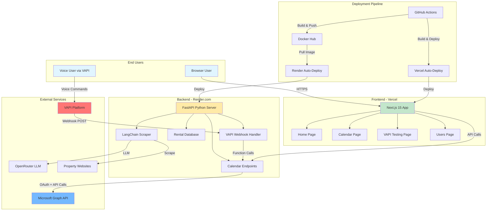

# PeteRental VAPI - Full Architecture Analysis

## Current Architecture Diagram



## THE REAL ISSUE

**Root Cause**: Render backend has NOT been deployed with the latest code that includes CORS middleware.

**Why "Failed to fetch"**: The production backend is running an OLD Docker image without:
- CORS headers allowing Vercel domain
- `/calendar/events` endpoint
- Updated error handling

**The Fix**: Manual deployment on Render dashboard

## Deployment Complexity Explained

### GitHub Actions → Docker Hub → Render (Current)
1. Code pushed to GitHub
2. GitHub Actions builds Docker image
3. Image pushed to Docker Hub as `mark0025/peterentalvapi:latest`
4. **Render MUST manually pull the new image** ⚠️

This is NOT automated because Render is configured to use a pre-built Docker image, not build from source.

### Alternative: Direct GitHub → Render
- Render could build directly from GitHub
- Slower deploys (Playwright install takes time)
- Would be fully automatic

## Should We Migrate to Next.js Only?

### NO - Keep Current Architecture

**Reasons**:
1. ✅ Python backend works well for:
   - VAPI webhooks
   - LangChain rental scraping
   - Playwright browser automation
   
2. ✅ Next.js frontend perfect for:
   - User interface
   - Testing tools
   - OAuth redirect pages

3. ✅ Separation of concerns is GOOD:
   - Frontend: UI/UX
   - Backend: Business logic, APIs, data processing

4. ✅ Current issue is just deployment config
   - Not an architecture problem
   - Just need to trigger Render deployment

## The Real Problem & Solution

### Problem
**Render requires manual deployment trigger** when using pre-built Docker images from Docker Hub.

### Solution Options

**Option 1: Manual Deploy (Quick Fix - Do This Now)**
1. Go to Render dashboard
2. Click "Manual Deploy" → "Deploy latest commit"
3. Wait 2-3 minutes
4. Test again - should work

**Option 2: Automate Render Deployment (Long-term)**
Add a step to GitHub Actions that triggers Render deployment via API:

```yaml
- name: Trigger Render Deploy
  run: |
    curl -X POST https://api.render.com/deploy/srv-XXXXX?key=YOUR_DEPLOY_KEY
```

**Option 3: Change Render to Build from GitHub (Slower)**
- Configure Render to build directly from GitHub repo
- Automatic deploys, but slower (5-7 min vs 2-3 min)

## Current Status

✅ Frontend: Working, deployed, correct env vars
⚠️ Backend: Docker image built, pushed to Docker Hub, **NOT deployed to Render yet**
🔧 Action Needed: Manual deploy on Render dashboard

After you deploy on Render, everything will work.
