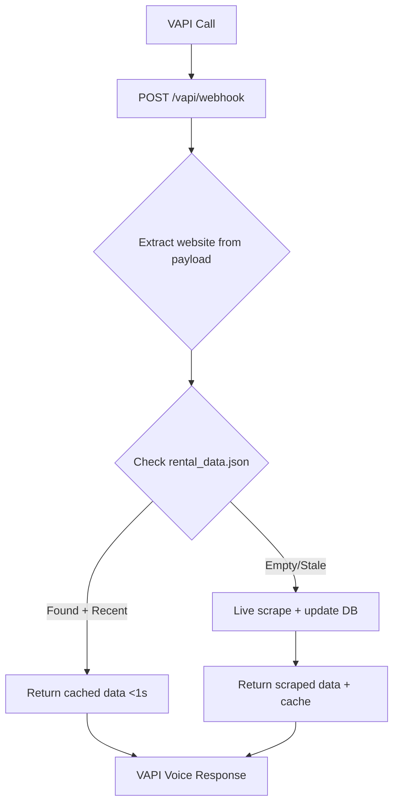
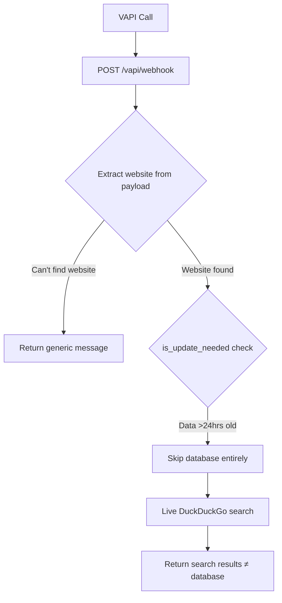

# PeteRental VAPI - Architecture Documentation

## 🏗️ System Overview

The PeteRental VAPI system is a simple **database lookup tool** designed to provide instant rental property information to VAPI voice calls. It should prioritize cached database responses over live scraping for optimal performance.

## 🎯 Core Functionality

**Primary Goal**: Return rental property data from database cache in <1 second
**Fallback**: Live scrape if database is empty or extremely stale

## 📁 Codebase Structure

```
peterental_vapi/
├── main.py                    # FastAPI app with database-first webhook
├── rental_database.py         # JSON-based database operations
├── rental_data.json          # Cached rental properties (4 entries)
├── langchain_rental_scraper.py # LangChain + OpenRouter scraper (fallback)
├── playwright_scraper.py     # Browser automation scraper (fallback)
├── Dockerfile                # Multi-stage container build
├── render.yaml               # Render deployment config
├── pyproject.toml            # uv dependencies
├── uv.lock                   # Locked dependency versions
└── DEV_MAN/                  # Documentation and planning
    ├── system_overview.md    # Existing system docs
    └── ARCHITECTURE.md       # This document
```

## 🔄 Request Flow Architecture

### Expected Flow (Database-First)


### Current Problematic Flow


## 📊 Database Architecture

### rental_data.json Structure
```json
{
  "last_updated": "2025-08-25T16:32:36.798625",
  "rentals": {
    "nolenpropertiesllc.managebuilding.com_1": {
      "id": "nolenpropertiesllc.managebuilding.com_1",
      "website": "nolenpropertiesllc.managebuilding.com",
      "scraped_at": "2025-08-25T16:32:36.794763",
      "data": {
        "address": "1000 Rambling Oaks - 6, Norman, OK 73072",
        "price": "$975",
        "bedrooms": 2,
        "bathrooms": 2,
        "square_feet": "756 sqft",
        "available_date": "July 15",
        "property_type": "condo"
      }
    }
  },
  "websites": {
    "nolenpropertiesllc.managebuilding.com": {
      "url": "https://nolenpropertiesllc.managebuilding.com",
      "last_scraped": "2025-08-25T16:32:36.797450",
      "rental_count": 4
    }
  }
}
```

### Database Operations
- **Load**: `rental_db.load_data()`
- **Query**: `rental_db.get_rentals_for_website(website)`
- **Check freshness**: `rental_db.is_update_needed()` 
- **Stats**: `rental_db.get_database_stats()`

## 🐳 Docker Deployment Architecture

### Dockerfile Analysis
```dockerfile
# Base: Microsoft Playwright (Ubuntu Noble + browsers)
FROM mcr.microsoft.com/playwright:v1.54.0-noble

# Python 3.12 + uv package manager
RUN apt-get update && apt-get install python3.12 python3.12-venv pipx

# Install uv via pipx (proper way)
RUN pipx install uv && pipx ensurepath

# Copy dependencies and install via uv
COPY pyproject.toml uv.lock ./
RUN uv sync --frozen

# Copy application code (includes rental_data.json)
COPY . .

# Non-root user for security
RUN useradd -m appuser && chown -R appuser:appuser /app
USER appuser

# Start FastAPI server
CMD ["uv", "run", "uvicorn", "main:app", "--host", "0.0.0.0", "--port", "8000"]
```

### Container Layers
1. **Base**: Playwright browsers (~2.5GB)
2. **Python**: 3.12 + development tools (~200MB)
3. **Dependencies**: uv-managed packages (~100MB)
4. **App Code**: Python files + JSON database (~1MB)

### Resource Usage
- **Idle**: 150-200MB RAM, 5-10% CPU
- **Active**: 400-600MB RAM, 50-80% CPU during scraping
- **Storage**: 2.8GB total container size

## 📡 API Endpoints

### Primary Endpoints
- `POST /vapi/webhook` - **Main VAPI integration point**
- `GET /database/status` - Database health and stats
- `GET /database/rentals/{website}` - Direct database query
- `GET /health` - Container health check

### Webhook Payload Handling
**VAPI sends this structure:**
```json
{
  "body": {
    "properties": {
      "website": {
        "value": "nolenpropertiesllc.managebuilding.com"
      }
    }
  }
}
```

**Current parsing logic:**
```python
# These checks FAIL with VAPI payload
website = request.get('website', '')  # Not found
website = request.get('body', {}).get('website', '')  # Not found

# NEEDED: Extract from nested structure
website = request.get('body', {}).get('properties', {}).get('website', {}).get('value', '')
```

## 🔄 Deployment Pipeline

### Local Development
```bash
# Install dependencies
uv sync

# Start with hot reload
uv run uvicorn main:app --reload

# Test database directly
uv run python -c "from rental_database import rental_db; print(rental_db.get_database_stats())"
```

### Docker Build & Push
```bash
# Build image locally
docker build -t mark0025/peterentalvapi:latest .

# Push to Docker Hub
docker push mark0025/peterentalvapi:latest

# Render auto-deploys from Docker Hub
```

### Render Deployment
- **Source**: Docker Hub `mark0025/peterentalvapi:latest`
- **URL**: https://peterentalvapi-latest.onrender.com
- **Auto-deploy**: On Docker Hub push
- **Environment**: `OPENROUTER_API_KEY` from Render dashboard

## 🚨 Current Issues & Root Causes

### Issue 1: Wrong Response Type
**Expected**: JSON with 4 rental properties from database
**Actual**: DuckDuckGo search results with 11 generic listings

**Root Cause**: Webhook skips database due to `is_update_needed()` returning True

### Issue 2: Payload Parsing
**Expected**: Extract website from VAPI payload structure  
**Actual**: Falls back to generic "what website?" response

**Root Cause**: Missing nested payload parsing for `body.properties.website.value`

### Issue 3: Response Format Mismatch
**Expected**: Instant database lookup (<1 second)
**Actual**: Live scraping (5-10 seconds) with different results

**Root Cause**: Logic prioritizes freshness over speed/consistency

## ✅ Local vs Deployed Behavior

### Local Testing (Docker)
```bash
# Container has correct code and data
docker exec container-name ls -la /app/
# Shows: rental_data.json, main.py, rental_database.py

# Database works correctly
curl http://localhost:8001/database/status
# Returns: 4 rentals, last updated 2025-08-25

# Webhook parsing fails but database is accessible
curl -X POST http://localhost:8001/vapi/webhook -d '{"website":"site.com"}'
```

### Deployed Testing (Render)
```bash
# Same container, same data
curl https://peterentalvapi-latest.onrender.com/database/status
# Returns: 4 rentals, last updated 2025-08-25

# Same webhook parsing issue
curl -X POST https://peterentalvapi-latest.onrender.com/vapi/webhook -d VAPI_PAYLOAD
# Returns: DuckDuckGo results instead of database
```

## 🔧 Fix Requirements

### Priority 1: Webhook Payload Parsing
Update `main.py` line ~167-176 to properly extract website:
```python
# ADD: Check VAPI nested structure
if not website:
    website = request.get('body', {}).get('properties', {}).get('website', {}).get('value', '')
```

### Priority 2: Database-First Logic
Modify `is_update_needed()` check to prefer database over live scraping:
```python
# Current: Skip database if >24 hours old
if not rental_db.is_update_needed():
    return cached_data

# Better: Use database unless empty or >7 days old
cached_data = rental_db.get_rentals_for_website(website)
if cached_data and not extremely_stale():
    return format_cached_response(cached_data)
```

### Priority 3: Response Consistency
Ensure both cached and scraped responses use same JSON structure for VAPI compatibility.

## 📈 Performance Targets

- **Database Response**: <1 second
- **Cache Hit Rate**: >90% for known websites  
- **Fallback Scraping**: <10 seconds max
- **Memory Usage**: <300MB steady state
- **Error Rate**: <5% for valid websites

## 🔮 MCP Integration Points

Following your rules, future MCP server integration should consider:

- **MCP Database Connector**: Direct queries to rental_data.json
- **MCP VAPI Bridge**: Protocol translation between MCP and VAPI
- **MCP Monitoring**: Real-time webhook performance metrics
- **MCP Content Updates**: Automated database refresh from multiple sources

---

## 🎯 Next Steps

1. **Fix webhook payload parsing** for VAPI compatibility
2. **Prioritize database responses** over live scraping  
3. **Test end-to-end** with actual VAPI voice calls
4. **Monitor response times** and cache hit rates
5. **Plan MCP integration** for expanded functionality

**Goal**: Simple, fast, reliable rental lookup tool that serves cached data instantly to VAPI voice calls.
