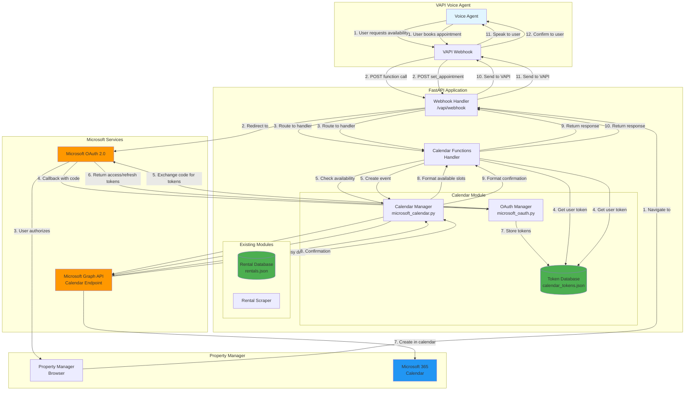
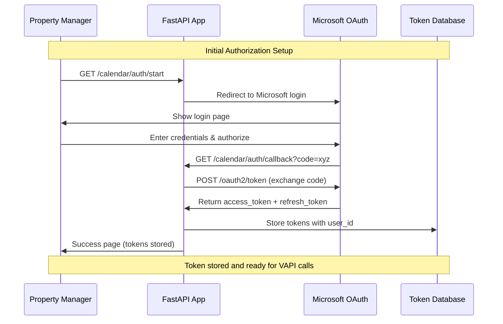
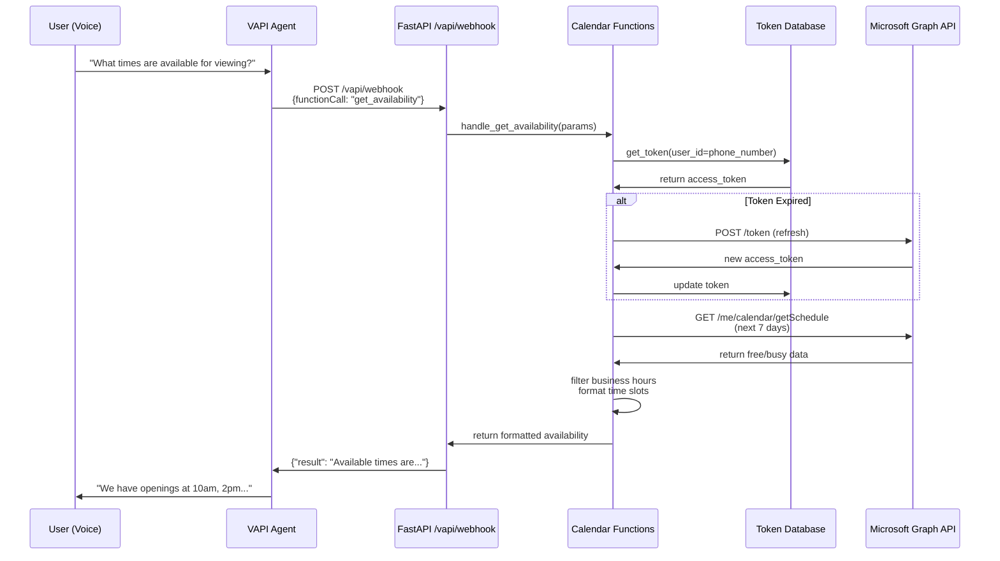
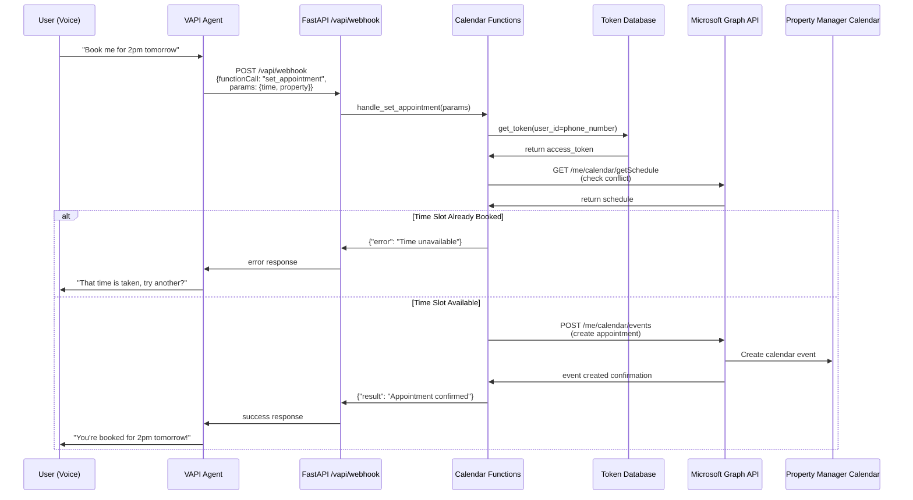
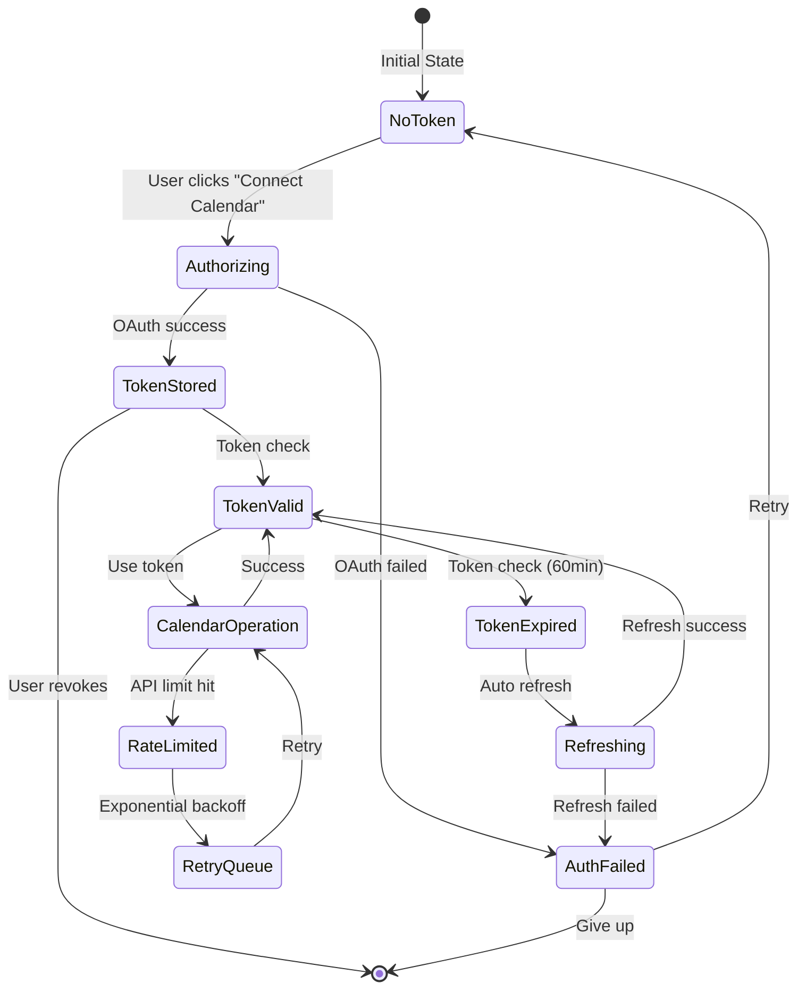
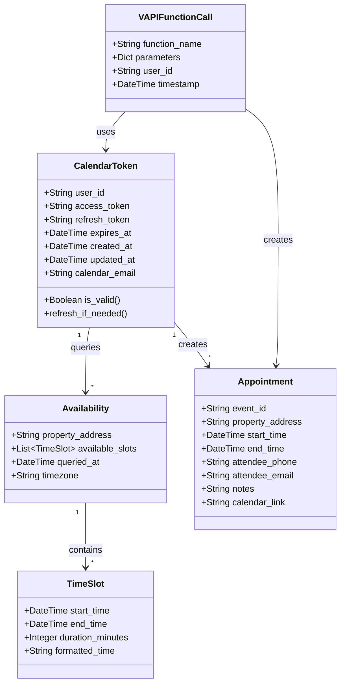
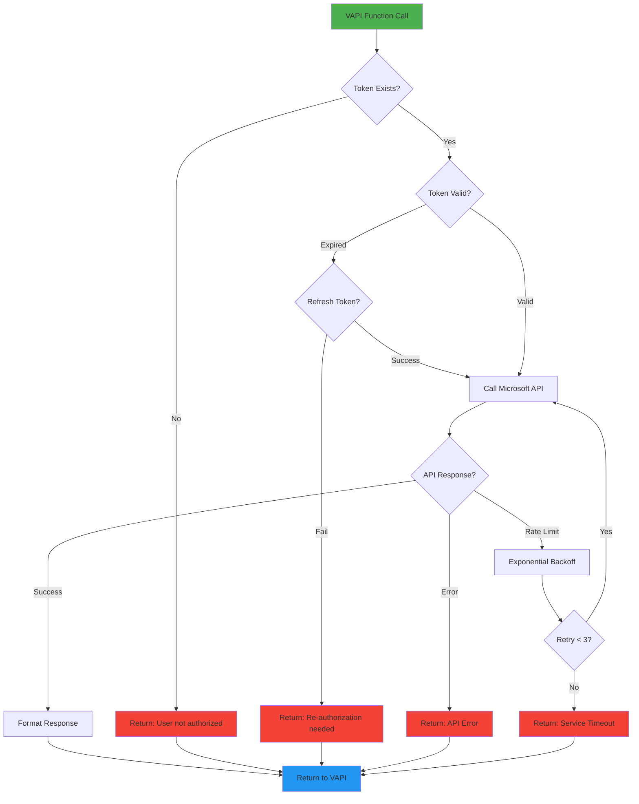
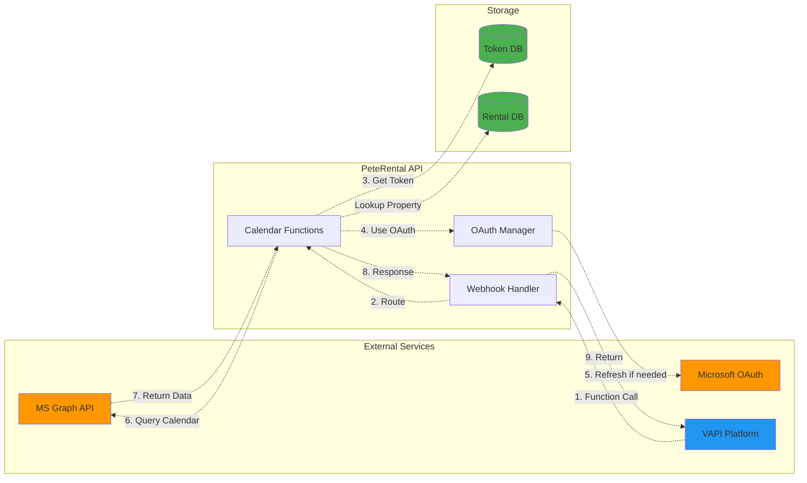

# Microsoft Calendar Integration - System Architecture

## 🏗️ System Flow Diagram



## 🔄 OAuth Authorization Flow



## 📞 VAPI Function Call Flow - get_availability



## 📅 VAPI Function Call Flow - set_appointment



## 🗂️ File Structure

```mermaid
graph TB
    subgraph "New Calendar Module"
        CAL_MOD[src/calendar/]
        CAL_MOD --> OAUTH_PY[microsoft_oauth.py<br/>OAuth flow handler]
        CAL_MOD --> CAL_PY[microsoft_calendar.py<br/>Graph API wrapper]
        CAL_MOD --> MODELS_PY[models.py<br/>Pydantic models]
    end

    subgraph "VAPI Functions"
        VAPI_FUNC[src/vapi/functions/]
        VAPI_FUNC --> CAL_FUNC[calendar_functions.py<br/>VAPI function handlers]
    end

    subgraph "Database"
        DATA[data/]
        DATA --> CAL_DB[calendar_tokens.json<br/>OAuth tokens]
        DATA --> RENT_DB[rentals.json<br/>Rental listings]
    end

    subgraph "API Routes"
        MAIN[main.py]
        MAIN --> AUTH_EP[/calendar/auth/*<br/>OAuth endpoints]
        MAIN --> WEBHOOK[/vapi/webhook<br/>Function handler]
    end

    subgraph "Configuration"
        ENV[.env]
        ENV --> MS_CLIENT[MICROSOFT_CLIENT_ID]
        ENV --> MS_SECRET[MICROSOFT_CLIENT_SECRET]
        ENV --> MS_TENANT[MICROSOFT_TENANT_ID]
    end

    OAUTH_PY -.->|reads| MS_CLIENT
    OAUTH_PY -.->|reads| MS_SECRET
    OAUTH_PY -.->|writes| CAL_DB
    CAL_PY -.->|reads| CAL_DB
    CAL_FUNC -.->|uses| CAL_PY
    CAL_FUNC -.->|uses| OAUTH_PY
    WEBHOOK -.->|routes to| CAL_FUNC
    AUTH_EP -.->|uses| OAUTH_PY

    style CAL_MOD fill:#4caf50
    style VAPI_FUNC fill:#2196f3
    style DATA fill:#ff9800
    style ENV fill:#f44336
```

## 🔐 Token Management Flow



## 🎯 Data Models



## 🚦 Error Handling Flow



## 📊 Integration Points


