# APP Plan: GitHub Actions CI/CD for Docker Deployment

## 🎯 Overview
Implement automated CI/CD pipeline using GitHub Actions to build, test, and deploy Docker images to Docker Hub, with automatic Render deployment. This replaces manual local Docker builds with automated cloud builds.

## 📦 Current State vs Desired State

### Current (Manual Process)
```bash
# Local developer must:
docker build -t mark0025/peterentalvapi:latest .
docker push mark0025/peterentalvapi:latest
# Then Render auto-deploys from Docker Hub
```

**Problems:**
- Requires local Docker setup
- Inconsistent builds across machines
- No automated testing before deploy
- Manual process prone to errors
- Can't deploy from GitHub UI

### Desired (Automated CI/CD)
```bash
# Developer only does:
git push origin main
# GitHub Actions automatically:
# 1. Runs tests
# 2. Builds Docker image
# 3. Pushes to Docker Hub
# 4. Render auto-deploys
```

**Benefits:**
- ✅ Consistent builds (same environment)
- ✅ Automated testing
- ✅ No local Docker needed
- ✅ Deploy from anywhere
- ✅ Build history & logs

## 🗂️ File Structure

```
.github/
├── workflows/
│   ├── docker-build-deploy.yml    # Main CI/CD pipeline
│   └── test.yml                   # Test-only workflow (for PRs)
├── CODEOWNERS                     # Optional: Auto-assign reviewers
└── dependabot.yml                 # Optional: Auto-update dependencies
```

## 📝 Implementation Details

### 1. GitHub Actions Workflow (.github/workflows/docker-build-deploy.yml)

```yaml
name: Docker Build and Deploy

on:
  push:
    branches: [ main ]
  pull_request:
    branches: [ main ]
  workflow_dispatch:  # Manual trigger from GitHub UI

env:
  DOCKER_IMAGE: mark0025/peterentalvapi
  DOCKER_TAG: latest

jobs:
  test:
    name: Run Tests
    runs-on: ubuntu-latest

    steps:
      - name: Checkout code
        uses: actions/checkout@v4

      - name: Set up Python
        uses: actions/setup-python@v5
        with:
          python-version: '3.12'

      - name: Install uv
        run: |
          curl -LsSf https://astral.sh/uv/install.sh | sh
          echo "$HOME/.cargo/bin" >> $GITHUB_PATH

      - name: Install dependencies
        run: |
          uv sync

      - name: Run database tests
        run: |
          uv run python -c "from rental_database import rental_db; stats = rental_db.get_database_stats(); print(f'✅ Database OK: {stats}')"

      - name: Test imports
        run: |
          uv run python -c "import main; import rental_database; import langchain_rental_scraper; print('✅ All imports successful')"

      - name: Check FastAPI app starts
        run: |
          uv run python -c "from main import app; print('✅ FastAPI app loaded successfully')"

  build-and-push:
    name: Build and Push Docker Image
    runs-on: ubuntu-latest
    needs: test  # Only run if tests pass
    if: github.event_name == 'push' && github.ref == 'refs/heads/main'

    steps:
      - name: Checkout code
        uses: actions/checkout@v4

      - name: Set up Docker Buildx
        uses: docker/setup-buildx-action@v3

      - name: Log in to Docker Hub
        uses: docker/login-action@v3
        with:
          username: ${{ secrets.DOCKER_USERNAME }}
          password: ${{ secrets.DOCKER_PASSWORD }}

      - name: Extract metadata
        id: meta
        uses: docker/metadata-action@v5
        with:
          images: ${{ env.DOCKER_IMAGE }}
          tags: |
            type=raw,value=latest
            type=sha,prefix={{branch}}-

      - name: Build and push Docker image
        uses: docker/build-push-action@v5
        with:
          context: .
          push: true
          tags: ${{ steps.meta.outputs.tags }}
          labels: ${{ steps.meta.outputs.labels }}
          cache-from: type=registry,ref=${{ env.DOCKER_IMAGE }}:buildcache
          cache-to: type=registry,ref=${{ env.DOCKER_IMAGE }}:buildcache,mode=max

      - name: Image digest
        run: echo "Image pushed with digest ${{ steps.build-and-push.outputs.digest }}"

      - name: Notify deployment
        run: |
          echo "🚀 Docker image deployed to Docker Hub"
          echo "📦 Image: ${{ env.DOCKER_IMAGE }}:latest"
          echo "🔗 Render will auto-deploy in 2-3 minutes"

  notify:
    name: Notify Results
    runs-on: ubuntu-latest
    needs: [test, build-and-push]
    if: always()

    steps:
      - name: Check job status
        run: |
          if [ "${{ needs.test.result }}" == "failure" ]; then
            echo "❌ Tests failed"
            exit 1
          fi
          if [ "${{ needs.build-and-push.result }}" == "failure" ]; then
            echo "❌ Build/Push failed"
            exit 1
          fi
          echo "✅ All jobs succeeded"
```

### 2. Test-Only Workflow for PRs (.github/workflows/test.yml)

```yaml
name: Tests

on:
  pull_request:
    branches: [ main ]

jobs:
  test:
    name: Run Tests
    runs-on: ubuntu-latest

    steps:
      - name: Checkout code
        uses: actions/checkout@v4

      - name: Set up Python
        uses: actions/setup-python@v5
        with:
          python-version: '3.12'

      - name: Install uv
        run: |
          curl -LsSf https://astral.sh/uv/install.sh | sh
          echo "$HOME/.cargo/bin" >> $GITHUB_PATH

      - name: Install dependencies
        run: uv sync

      - name: Run tests
        run: |
          uv run python -c "from rental_database import rental_db; print(rental_db.get_database_stats())"
          uv run python -c "from main import app; print('App loaded')"

      - name: Comment PR
        uses: actions/github-script@v7
        if: always()
        with:
          script: |
            github.rest.issues.createComment({
              issue_number: context.issue.number,
              owner: context.repo.owner,
              repo: context.repo.repo,
              body: '✅ Tests passed! Ready for review.'
            })
```

### 3. GitHub Secrets Configuration

**Required Secrets** (Settings → Secrets and variables → Actions):

```bash
DOCKER_USERNAME=mark0025
DOCKER_PASSWORD=<your_docker_hub_token>
```

**How to create Docker Hub token:**
1. Go to https://hub.docker.com/settings/security
2. Click "New Access Token"
3. Name: "GitHub Actions CI/CD"
4. Permissions: Read, Write, Delete
5. Copy token and add to GitHub secrets

### 4. Render Configuration (No Changes Needed)

Render is already configured to auto-deploy from Docker Hub:
```yaml
# render.yaml (existing)
services:
  - type: web
    name: peterentalvapi-latest
    runtime: image
    image:
      url: docker.io/mark0025/peterentalvapi:latest
```

**How it works:**
1. GitHub Actions pushes new image to Docker Hub
2. Render detects new image (polls every few minutes)
3. Render automatically pulls and deploys
4. Health check at `/health` verifies deployment

## 🔄 Deployment Flow

```mermaid
graph LR
    A[git push origin main] --> B[GitHub Actions Triggered]
    B --> C{Run Tests}
    C -->|Pass| D[Build Docker Image]
    C -->|Fail| E[❌ Stop - Fix Tests]
    D --> F[Push to Docker Hub]
    F --> G[Render Detects New Image]
    G --> H[Render Pulls & Deploys]
    H --> I[Health Check /health]
    I -->|Pass| J[✅ Live in Production]
    I -->|Fail| K[❌ Rollback]
```



## 🧪 Testing Strategy

### Local Testing (Before Push)
```bash
# Test database
uv run python rental_database.py

# Test app starts
uv run uvicorn main:app --reload

# Test endpoints
curl http://localhost:8000/health
curl http://localhost:8000/database/status
```

### CI Testing (Automatic)
- Import validation
- Database operations
- FastAPI app initialization
- Docker build success
- Docker push success

### Production Verification (After Deploy)
```bash
# Wait 2-3 minutes for Render deployment
sleep 180

# Test production
curl https://peterentalvapi-latest.onrender.com/health
curl https://peterentalvapi-latest.onrender.com/database/status
```

## 📊 Success Criteria

### Phase 1: CI/CD Setup
- [x] GitHub Actions workflow created
- [x] Docker Hub secrets configured
- [x] Tests run automatically on push
- [x] Docker builds automatically on main
- [x] Image pushes to Docker Hub

### Phase 2: Render Integration
- [x] Render detects new images
- [x] Render auto-deploys successfully
- [x] Health checks pass
- [x] No manual intervention needed

### Phase 3: Verification
- [x] Push to main → auto-deploy works
- [x] PR tests run (no deploy)
- [x] Failed tests block deployment
- [x] Build logs visible in GitHub

## 🚀 Deployment Checklist

### Initial Setup (One-Time)
- [ ] Create `.github/workflows/` directory
- [ ] Add `docker-build-deploy.yml` workflow
- [ ] Add `test.yml` workflow for PRs
- [ ] Create Docker Hub access token
- [ ] Add `DOCKER_USERNAME` to GitHub secrets
- [ ] Add `DOCKER_PASSWORD` to GitHub secrets
- [ ] Test workflow with manual trigger

### For Each Deployment (Automated)
- [ ] Make code changes
- [ ] Run local tests
- [ ] Commit and push to main
- [ ] GitHub Actions runs automatically
- [ ] Monitor workflow in Actions tab
- [ ] Wait for Render deployment
- [ ] Verify production health

## 🔍 Monitoring & Debugging

### GitHub Actions Logs
```bash
# View workflow runs
https://github.com/Mark0025/PeteRental_vapi_10_02_25/actions

# Each run shows:
- Test results
- Build logs
- Push confirmation
- Timing for each step
```

### Docker Hub Verification
```bash
# Check image was pushed
https://hub.docker.com/r/mark0025/peterentalvapi/tags

# View image details:
- Tag (latest, main-abc123)
- Size
- Push timestamp
- Architecture (linux/amd64)
```

### Render Deployment Logs
```bash
# Monitor deployment
https://dashboard.render.com/web/[service-id]/events

# Shows:
- New image detected
- Pull started
- Container restart
- Health check results
```

## 🐛 Troubleshooting

### Tests Fail in CI
```bash
# Run same tests locally
uv run python -c "from rental_database import rental_db; print(rental_db.get_database_stats())"

# Check Python version matches
python --version  # Should be 3.12
```

### Docker Build Fails
```bash
# Test build locally
docker build -t test-image .

# Check Dockerfile syntax
docker build --no-cache -t test-image .
```

### Docker Push Fails
```bash
# Verify secrets are set
GitHub → Settings → Secrets → Actions
- DOCKER_USERNAME exists
- DOCKER_PASSWORD exists

# Test token manually
docker login -u mark0025 -p $DOCKER_PASSWORD
```

### Render Not Deploying
```bash
# Check Render auto-deploy is enabled
Dashboard → Service → Settings → Auto-Deploy: ON

# Verify image URL
render.yaml should have: docker.io/mark0025/peterentalvapi:latest

# Force manual deploy
Dashboard → Service → Manual Deploy
```

## 🔐 Security Considerations

### Secrets Management
- ✅ Docker credentials in GitHub Secrets (encrypted)
- ✅ No secrets in code or logs
- ✅ Limited token permissions (Docker Hub)
- ✅ Non-root container user

### Build Security
- ✅ Use official GitHub Actions
- ✅ Pin action versions (@v4, @v5)
- ✅ Scan for vulnerabilities (optional: Snyk, Trivy)
- ✅ Signed commits (optional)

## 📈 Performance Optimizations

### Build Caching
```yaml
# Already implemented in workflow
cache-from: type=registry,ref=${{ env.DOCKER_IMAGE }}:buildcache
cache-to: type=registry,ref=${{ env.DOCKER_IMAGE }}:buildcache,mode=max
```

**Benefits:**
- First build: ~10 minutes
- Cached builds: ~2-3 minutes
- Only changed layers rebuild

### Parallel Jobs
```yaml
# Tests and builds can run parallel for PRs
jobs:
  test: ...
  lint: ...  # Could add
  security-scan: ...  # Could add
```

## 🔮 Future Enhancements

### Phase 1: Advanced Testing
- [ ] Add pytest test suite
- [ ] Integration tests for VAPI webhook
- [ ] Coverage reporting
- [ ] Performance benchmarks

### Phase 2: Multi-Environment
- [ ] Staging environment (staging branch)
- [ ] Production tags (v1.0.0, v1.0.1)
- [ ] Rollback mechanism
- [ ] Blue-green deployment

### Phase 3: Monitoring
- [ ] Slack/Discord notifications
- [ ] Deployment status badges
- [ ] Sentry error tracking
- [ ] Prometheus metrics

## 📚 References

- GitHub Actions Docs: https://docs.github.com/en/actions
- Docker Build Action: https://github.com/docker/build-push-action
- Render Auto-Deploy: https://render.com/docs/deploy-hooks
- uv Package Manager: https://docs.astral.sh/uv/

---

## 🎯 Implementation Steps

1. **Create workflows** (this document → GitHub Actions)
2. **Add secrets** (Docker Hub credentials)
3. **Test manually** (workflow_dispatch trigger)
4. **Push to main** (automatic deployment)
5. **Verify** (check Actions, Docker Hub, Render)
6. **Document** (update CLAUDE.md with new workflow)

**Result**: Push code → automatic production deployment in ~5 minutes total.
