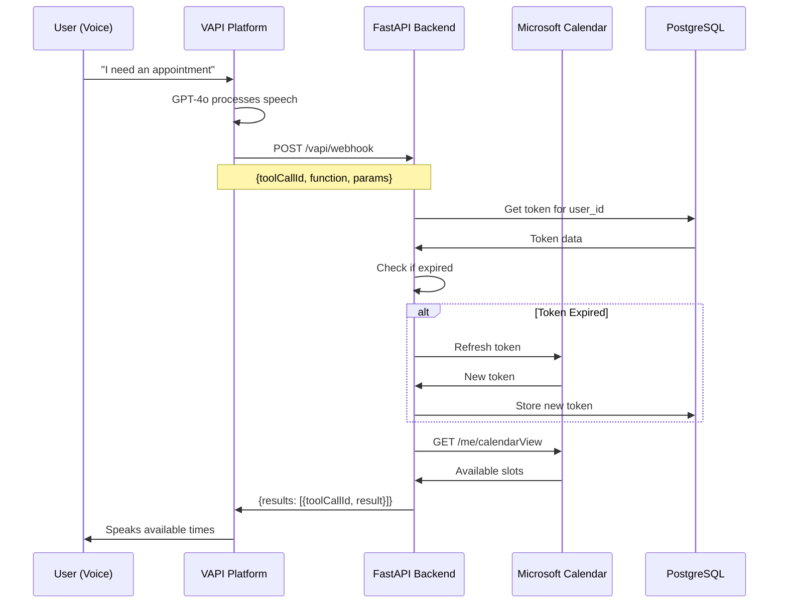

# Complete System Analysis & Architecture
## PeteRental VAPI Multi-Agent Platform

**Generated:** October 9, 2025
**Purpose:** Comprehensive analysis of current architecture and roadmap for multi-agent VAPI system
**Analyst:** Claude Code

---

## Table of Contents
1. [Executive Summary](#executive-summary)
2. [Current State Analysis](#current-state-analysis)
3. [System Architecture](#system-architecture)
4. [File Structure & Trace Routes](#file-structure--trace-routes)
5. [What's Working](#whats-working)
6. [Issues & Duplicates](#issues--duplicates)
7. [Multi-Agent Roadmap](#multi-agent-roadmap)
8. [Security & Best Practices](#security--best-practices)
9. [Recommendations](#recommendations)

---

## Executive Summary

### Current System Overview
You have a **FastAPI-based VAPI integration platform** that serves two primary functions:
1. **Property Management:** Appointment booking via Microsoft Calendar
2. **Rental Search:** Web scraping for rental property listings

### Critical Findings

**✅ WORKING:**
- Calendar integration with Microsoft Graph API
- VAPI webhook handling with correct response format
- Token management with auto-refresh
- One functional agent for property viewing appointments
- Dual storage: PostgreSQL (prod) + JSON (dev)

**⚠️ LIMITATIONS:**
- Only ONE agent configured (not multi-agent ready)
- No session tracking per agent
- User management hardcoded (mark@peterei.com, pete_admin)
- No way to organize appointments by which agent took them
- Duplicate code patterns (2 calendar implementations)

**🚀 NEEDED FOR MULTI-AGENT:**
- Agent-aware session management
- Per-agent appointment tracking
- User email authentication system
- Agent ID passed in VAPI webhook payload
- Centralized agent registry

---

## Current State Analysis

### System Components

```
┌─────────────────────────────────────────────────────────────────┐
│                    CURRENT ARCHITECTURE                          │
└─────────────────────────────────────────────────────────────────┘

┌──────────────┐         ┌──────────────┐         ┌──────────────┐
│   Frontend   │         │     VAPI     │         │   Backend    │
│  (Next.js)   │────────▶│   Platform   │────────▶│  (FastAPI)   │
│              │         │              │         │              │
│ vapi-agent   │         │ 1 Assistant  │         │ main.py      │
│  page.tsx    │         │ Configured   │         │ 1084 lines   │
└──────────────┘         └──────────────┘         └──────────────┘
                                                           │
                         ┌─────────────────────────────────┤
                         │                                 │
                ┌────────▼────────┐              ┌────────▼────────┐
                │  Microsoft      │              │  Rental         │
                │  Calendar       │              │  Database       │
                │  (Graph API)    │              │  (JSON)         │
                └─────────────────┘              └─────────────────┘
                         │                                 │
                ┌────────▼────────┐              ┌────────▼────────┐
                │  PostgreSQL     │              │  LangChain      │
                │  (Tokens)       │              │  Scraper        │
                └─────────────────┘              └─────────────────┘
```

### Data Flow

**VAPI Call → Webhook → Response**



---

## System Architecture

### Full Application Map

```
PeteRental VAPI Platform
========================

ROOT: /Users/markcarpenter/Desktop/pete/PeteRental_vapi_10_02_25/

CORE APPLICATION
├── main.py (1084 lines)                       # Main FastAPI app
│   ├── Root endpoints (/, /health)
│   ├── Calendar OAuth flow (/calendar/*)
│   ├── VAPI webhook handler (/vapi/webhook)
│   ├── Database endpoints (/database/*)
│   └── VAPI assistants endpoint (/vapi/assistants)
│
├── Dockerfile                                 # Multi-stage build (Python + Playwright)
├── docker-compose.yml                         # Local dev setup
├── pyproject.toml                             # uv package manager config
├── uv.lock                                    # Locked dependencies
└── .env                                       # Environment variables

SOURCE CODE (src/)
├── vapi/
│   └── functions/
│       ├── __init__.py
│       └── calendar_functions.py              # CalendarFunctions class
│           ├── handle_get_availability()      # Returns available slots
│           └── handle_set_appointment()       # Books appointment
│
└── calendar/
    ├── __init__.py
    ├── microsoft_oauth.py                     # MicrosoftOAuth class
    │   ├── get_authorization_url()
    │   ├── exchange_code_for_token()
    │   └── refresh_access_token()
    │
    ├── microsoft_calendar.py                  # MicrosoftCalendar class
    │   ├── get_availability()                 # Graph API: calendarView
    │   └── create_appointment()               # Graph API: events
    │
    ├── token_manager.py                       # TokenManager class (DUAL STORAGE)
    │   ├── PostgreSQL methods                 # Production
    │   ├── JSON file methods                  # Local dev
    │   └── Auto-detects based on DATABASE_URL
    │
    └── simple_calendar.py                     # SimpleCalendar class (TESTING ONLY)
        ├── JSON-based storage
        └── No Microsoft account needed

DATA STORAGE (data/)
├── appointments.json                          # SimpleCalendar storage (empty)
├── calendar_tokens.json                       # TokenManager file fallback
└── rental_data.json                           # Cached rental properties

SCRAPERS
├── langchain_rental_scraper.py                # LangChain + Playwright agent
├── playwright_scraper.py                      # Direct Playwright scraper
└── rental_database.py                         # Rental property database

UTILITIES
├── auth_wizard.py                             # CLI tool for OAuth
├── authorize_calendar.py                      # OAuth helper
├── verify_vapi_config.py                      # VAPI config checker
├── update_vapi_functions.py                   # Sync functions to VAPI
├── test_calendar_vapi.py                      # Integration tests
├── test_calendar_endpoints.py                 # Endpoint tests
└── whatsworking.py                            # Status reporter

DEPLOYMENT
├── deploy.sh                                  # Production deploy
├── deploy_docker.sh                           # Docker deploy
├── docker_build_push.sh                       # Build + push to Docker Hub
├── docker_hub_deploy.sh                       # Docker Hub deploy
├── start_dev.sh                               # Local dev server
├── start_prod.sh                              # Local prod mode
├── recreate_vapi_tools.sh                     # VAPI tool sync
└── setup_github_secrets.sh                    # GitHub Actions setup

CI/CD
└── .github/workflows/
    ├── docker-build-deploy.yml                # Docker Hub pipeline
    └── test.yml                               # Test pipeline

DOCUMENTATION (DEV_MAN/)
├── README.md                                  # Documentation index
├── ARCHITECTURE.md                            # Old architecture doc
├── system_overview.md                         # System overview
├── BEHAVIOR_ANALYSIS.md                       # Behavior analysis
├── DEPLOYMENT_PIPELINE.md                     # Deployment guide
├── troubleshooting.md                         # Troubleshooting
├── CALENDAR_INTEGRATION_APP_PLAN.md           # Calendar planning
├── CALENDAR_INTEGRATION_ASKI.md               # ASCII diagrams
├── CALENDAR_INTEGRATION_MERMAID.md            # Mermaid diagrams
├── CICD_DOCKER_PIPELINE_APP_PLAN.md           # CI/CD planning
├── DEVMAN_DASHBOARD_APP_PLAN.md               # Dashboard planning
├── NEXTJS_FRONTEND_APP_PLAN.md                # Frontend planning
└── COMPLETE_SYSTEM_ANALYSIS.md                # This document

ROOT DOCUMENTATION
├── ARCHITECTURE.md                            # System architecture
├── WHATS_WORKING.md                          # Working features
├── VAPI_NETWORK_ANALYSIS.md                  # Network analysis
├── VAPI_SETUP.md                             # VAPI setup guide
├── RENDER_DEPLOYMENT.md                      # Render deployment
├── RENDER_ENV_VARS.md                        # Environment variables
├── CLEANUP_SUMMARY.md                        # Cleanup notes
├── FIX_CALENDAR_QUICK.md                     # Quick fixes
├── FINISH_SETUP.md                           # Setup completion
├── PROJECT_MASTER.md                         # Project master plan
├── API_DOCS.md                               # API documentation
└── CLAUDE.md                                 # Project instructions

DEPRECATED (_deprecated/)
└── [Old VAPI router and test files]
    └── These files are no longer used

CONFIGURATION FILES
├── vapi_calendar_functions.json               # VAPI function definitions
└── render.yaml                                # Render deployment config
```

### Network Diagram

```
┌─────────────────────────────────────────────────────────────────────┐
│                         NETWORK ARCHITECTURE                         │
└─────────────────────────────────────────────────────────────────────┘

EXTERNAL SERVICES
┌────────────────────┐  ┌────────────────────┐  ┌────────────────────┐
│  VAPI Platform     │  │  Microsoft Graph   │  │  OpenRouter LLM    │
│  vapi.ai           │  │  graph.microsoft   │  │  openrouter.ai     │
│                    │  │      .com          │  │                    │
│ ┌────────────────┐ │  │                    │  │                    │
│ │ Voice Agent    │ │  │ /v1.0/me/calendar  │  │  gpt-4o model      │
│ │ GPT-4o + Elliot│ │  │ /v1.0/me/events    │  │  (for scraping)    │
│ └────────────────┘ │  │                    │  │                    │
└──────────┬─────────┘  └──────────┬─────────┘  └──────────┬─────────┘
           │                       │                       │
           │ HTTPS Webhook         │ OAuth 2.0             │ API Key
           │                       │ + Bearer Token        │
           │                       │                       │
INTERNET BOUNDARY ─────────────────┼───────────────────────┼──────────
           │                       │                       │
           │                       │                       │
           │                       │                       │
           ▼                       ▼                       ▼
┌───────────────────────────────────────────────────────────────────┐
│                       RENDER.COM INFRASTRUCTURE                    │
│                                                                    │
│  ┌──────────────────────────────────────────────────────────────┐ │
│  │  peterentalvapi-latest.onrender.com                          │ │
│  │                                                               │ │
│  │  ┌────────────────────────────────────────────┐              │ │
│  │  │  Docker Container                           │              │ │
│  │  │  Image: mark0025/peterentalvapi:latest     │              │ │
│  │  │                                             │              │ │
│  │  │  ┌──────────────────────────────────────┐  │              │ │
│  │  │  │  FastAPI Application (main.py)       │  │              │ │
│  │  │  │  Port: 8000                          │  │              │ │
│  │  │  │                                       │  │              │ │
│  │  │  │  Endpoints:                          │  │              │ │
│  │  │  │  • GET  /                            │  │              │ │
│  │  │  │  • GET  /health                      │  │              │ │
│  │  │  │  • POST /vapi/webhook ◄──────────────┼──┼───── VAPI    │ │
│  │  │  │  • GET  /calendar/auth/start         │  │              │ │
│  │  │  │  • GET  /calendar/auth/callback      │  │              │ │
│  │  │  │  • GET  /calendar/auth/status        │  │              │ │
│  │  │  │  • GET  /database/status             │  │              │ │
│  │  │  │  • GET  /vapi/assistants             │  │              │ │
│  │  │  └────────────┬─────────────────────────┘  │              │ │
│  │  │               │                             │              │ │
│  │  │  ┌────────────▼─────────────────────────┐  │              │ │
│  │  │  │  Application Modules                 │  │              │ │
│  │  │  │                                      │  │              │ │
│  │  │  │  • calendar_functions.py             │  │              │ │
│  │  │  │  • microsoft_calendar.py             │  │              │ │
│  │  │  │  • microsoft_oauth.py                │  │              │ │
│  │  │  │  • token_manager.py                  │  │              │ │
│  │  │  │  • langchain_rental_scraper.py       │  │              │ │
│  │  │  │  • rental_database.py                │  │              │ │
│  │  │  └──────────────────────────────────────┘  │              │ │
│  │  └─────────────────────────────────────────────┘              │ │
│  └───────────────────────────────────────────────────────────────┘ │
│                                                                     │
│  ┌──────────────────────────────────────────────────────────────┐  │
│  │  PostgreSQL Database                                         │  │
│  │                                                               │  │
│  │  Tables:                                                     │  │
│  │  • oauth_tokens (user_id, access_token, refresh_token, ...)│  │
│  │                                                               │  │
│  │  Environment: DATABASE_URL                                  │  │
│  └──────────────────────────────────────────────────────────────┘  │
│                                                                     │
└─────────────────────────────────────────────────────────────────────┘

LOCAL DEVELOPMENT
┌─────────────────────────────────────────────────────────────────────┐
│  localhost:8001                                                      │
│                                                                      │
│  • Same FastAPI app                                                 │
│  • JSON file storage (data/)                                        │
│  • No PostgreSQL required                                           │
│  • ngrok tunnel (start_dev.sh)                                      │
└─────────────────────────────────────────────────────────────────────┘

FRONTEND
┌─────────────────────────────────────────────────────────────────────┐
│  peterental-nextjs.vercel.app                                       │
│                                                                      │
│  Pages:                                                             │
│  • /vapi-agent (VAPI Web SDK integration)                          │
│  • /users (User management)                                         │
│                                                                      │
│  Environment: NEXT_PUBLIC_VAPI_ASSISTANT_ID                        │
└─────────────────────────────────────────────────────────────────────┘
```

### Request Trace Routes

#### Route 1: Calendar Availability Check

```
USER SPEAKS: "What times are available?"
    │
    ├─▶ [1] VAPI Platform (vapi.ai)
    │       Speech-to-Text (Deepgram)
    │       GPT-4o processes: "User wants availability"
    │       Decision: Call get_availability function
    │
    ├─▶ [2] HTTP POST to Backend
    │       URL: https://peterentalvapi-latest.onrender.com/vapi/webhook
    │       Headers: Content-Type: application/json
    │       Payload: {
    │           "message": {
    │               "toolCalls": [{
    │                   "id": "call_ABC123",
    │                   "function": {
    │                       "name": "get_availability",
    │                       "arguments": {
    │                           "user_id": "mark@peterei.com",
    │                           "property_address": "123 Main St"
    │                       }
    │                   }
    │               }]
    │           }
    │       }
    │
    ├─▶ [3] Backend Processing (main.py:717-817)
    │       Extract toolCallId = "call_ABC123"
    │       Route to calendar_functions.handle_get_availability()
    │
    ├─▶ [4] Token Manager (token_manager.py)
    │       Query PostgreSQL for user_id="mark@peterei.com"
    │       Check if token expired
    │       If expired: refresh via Microsoft OAuth
    │
    ├─▶ [5] Microsoft Calendar API (microsoft_calendar.py)
    │       GET https://graph.microsoft.com/v1.0/me/calendarView
    │       Headers: Authorization: Bearer {access_token}
    │       Params: startDateTime, endDateTime
    │       Response: Array of calendar events (busy times)
    │
    ├─▶ [6] Availability Calculation
    │       Generate business hour slots (9 AM - 5 PM)
    │       Exclude busy times from Microsoft Calendar
    │       Format top 3 slots for voice response
    │
    ├─▶ [7] Response to VAPI
    │       {
    │           "results": [{
    │               "toolCallId": "call_ABC123",
    │               "result": "I have several viewing times available..."
    │           }]
    │       }
    │       Response time: ~300-400ms
    │
    └─▶ [8] VAPI Speaks to User
            Text-to-Speech (Elliot voice)
            "I have several viewing times available for 123 Main Street.
             Here are the next available slots: Tuesday, October 07..."
```

#### Route 2: Create Appointment

```
USER SPEAKS: "Book Tuesday at 2 PM"
    │
    ├─▶ [1] VAPI Platform
    │       GPT-4o extracts: date="2025-10-07", time="14:00"
    │       Asks for: attendee_name, attendee_email
    │       Decision: Call set_appointment function
    │
    ├─▶ [2] HTTP POST to Backend
    │       Payload: {
    │           "message": {
    │               "toolCalls": [{
    │                   "id": "call_XYZ789",
    │                   "function": {
    │                       "name": "set_appointment",
    │                       "arguments": {
    │                           "user_id": "mark@peterei.com",
    │                           "property_address": "123 Main St",
    │                           "start_time": "2025-10-07T14:00:00Z",
    │                           "attendee_name": "John Doe",
    │                           "attendee_email": "john@example.com"
    │                       }
    │                   }
    │               }]
    │           }
    │       }
    │
    ├─▶ [3] Backend Processing
    │       Route to calendar_functions.handle_set_appointment()
    │
    ├─▶ [4] Token Manager
    │       Get valid token (same as Route 1)
    │
    ├─▶ [5] Microsoft Calendar API
    │       POST https://graph.microsoft.com/v1.0/me/events
    │       Body: {
    │           "subject": "Property Viewing: 123 Main St",
    │           "start": {"dateTime": "2025-10-07T14:00:00Z"},
    │           "end": {"dateTime": "2025-10-07T14:30:00Z"},
    │           "attendees": [{"emailAddress": {"address": "john@example.com"}}]
    │       }
    │       Response: Created event with ID
    │
    ├─▶ [6] Response to VAPI
    │       {
    │           "results": [{
    │               "toolCallId": "call_XYZ789",
    │               "result": "Perfect! I've booked your viewing for..."
    │           }]
    │       }
    │
    └─▶ [7] VAPI Confirms + Calendar Invite Sent
            Microsoft sends email to john@example.com
            User hears confirmation
```

#### Route 3: OAuth Authorization Flow

```
ADMIN VISITS: /calendar/setup
    │
    ├─▶ [1] Browser loads HTML page (main.py:82-303)
    │       User enters user_id (e.g., "mark@peterei.com")
    │       Clicks "Connect Microsoft Calendar"
    │
    ├─▶ [2] Redirect to OAuth Start
    │       GET /calendar/auth/start?user_id=mark@peterei.com
    │       Generate state: "mark@peterei.com:random_token"
    │
    ├─▶ [3] Redirect to Microsoft
    │       URL: https://login.microsoftonline.com/consumers/oauth2/v2.0/authorize
    │       Params:
    │           client_id: {MICROSOFT_CLIENT_ID}
    │           response_type: code
    │           redirect_uri: {REDIRECT_URI}/calendar/auth/callback
    │           scope: Calendars.ReadWrite offline_access
    │           state: {state}
    │
    ├─▶ [4] User Authorizes on Microsoft
    │       Signs in with Microsoft account
    │       Grants calendar permissions
    │
    ├─▶ [5] Microsoft Callback
    │       GET /calendar/auth/callback?code={auth_code}&state={state}
    │
    ├─▶ [6] Exchange Code for Token (microsoft_oauth.py)
    │       POST https://login.microsoftonline.com/consumers/oauth2/v2.0/token
    │       Body:
    │           client_id, client_secret, code, redirect_uri
    │       Response: {
    │           access_token: "...",
    │           refresh_token: "...",
    │           expires_in: 3600
    │       }
    │
    ├─▶ [7] Store Token (token_manager.py)
    │       INSERT INTO oauth_tokens (user_id, access_token, ...)
    │       ON CONFLICT UPDATE
    │
    └─▶ [8] Redirect to Frontend
            URL: https://peterental-nextjs.vercel.app/users
            Params: ?auth=success&email=mark@peterei.com
```

---

## What's Working

### ✅ Fully Functional Components

1. **Calendar Integration**
   - Microsoft OAuth 2.0 flow working
   - Token storage in PostgreSQL
   - Auto-refresh before expiration
   - get_availability function (64 slots found)
   - set_appointment function (creates events)
   - Location: `src/calendar/*.py`

2. **VAPI Webhook**
   - Correct response format with toolCallId
   - ~300-400ms response time
   - Handles both calendar functions
   - Verbose logging for debugging
   - Location: `main.py:717-817`

3. **Database Systems**
   - **PostgreSQL** (Production)
     - Token storage
     - Auto-created tables
     - Connection via DATABASE_URL
   - **JSON Files** (Development)
     - Fallback for local dev
     - No PostgreSQL required
     - Location: `data/*.json`

4. **Rental Scraping** (Secondary Feature)
   - DuckDuckGo search integration
   - LangChain + Playwright agent
   - Intelligent property extraction
   - Cached in rental_data.json
   - Location: `langchain_rental_scraper.py`

5. **Deployment**
   - Docker multi-stage build working
   - Render deployment active
   - Health checks passing
   - Auto-deploy on push (optional)
   - Location: `Dockerfile`, `render.yaml`

### ✅ Current VAPI Agent Configuration

**Agent ID:** `24464697-8f45-4b38-b43a-d337f50c370e`
**Name:** "Appointemt setter agent" (typo in original)
**Model:** GPT-4o (OpenAI)
**Voice:** Elliot (VAPI provider)

**Functions:**
1. `get_availability` (Tool ID: cec6f21b-8b74-47a6-b73d-633eb9d71930)
2. `set_appointment` (Tool ID: 0903d34d-6f63-4430-b06e-a908a0056209)

**Configuration:**
- blocking: true ✅
- timeoutSeconds: 20 ✅
- async: false ✅
- Webhook: peterentalvapi-latest.onrender.com ✅

### ✅ Testing Infrastructure

- test_calendar_vapi.py - Integration tests
- test_calendar_endpoints.py - Endpoint tests
- auth_wizard.py - CLI OAuth tool
- verify_vapi_config.py - Config checker
- whatsworking.py - Status reporter

---

## Issues & Duplicates

### ⚠️ Code Duplicates

#### 1. **Two Calendar Implementations**

**MicrosoftCalendar** (src/calendar/microsoft_calendar.py)
- **Status:** ✅ ACTIVE - Used in production
- **Backend:** Microsoft Graph API
- **Features:** Real calendar integration
- **Methods:** get_availability(), create_appointment()

**SimpleCalendar** (src/calendar/simple_calendar.py)
- **Status:** ⚠️ UNUSED - Testing only
- **Backend:** JSON file (data/appointments.json)
- **Features:** Mock calendar for testing
- **Methods:** get_availability(), create_appointment()

**Recommendation:** Keep both but clearly document usage
- MicrosoftCalendar = Production
- SimpleCalendar = Local testing without Microsoft account

#### 2. **Deprecated Code**

**Location:** `_deprecated/`
- Old VAPI router implementation
- Test scripts from earlier development
- Old function creation scripts

**Recommendation:** Can be safely deleted (already moved to _deprecated)

#### 3. **Multiple Documentation Files**

Too many overlapping docs in root and DEV_MAN/:
- ARCHITECTURE.md (2 versions)
- Multiple "WHAT'S WORKING" docs
- Redundant setup guides

**Recommendation:** Consolidate into DEV_MAN/ directory only

### ⚠️ Current Limitations

1. **Single Agent Only**
   - Only 1 VAPI assistant configured
   - No way to distinguish between multiple agents
   - All appointments go to same calendar

2. **Hardcoded User IDs**
   - user_id defaults to "pete_admin" or "mark@peterei.com"
   - No dynamic user management
   - No email-based authentication

3. **No Session Tracking**
   - Cannot track which agent handled which call
   - No agent_id in database
   - Cannot filter appointments by agent

4. **No Multi-Calendar Support**
   - All agents use same Microsoft Calendar
   - Cannot have different calendars per agent
   - No calendar selection logic

---

## Multi-Agent Roadmap

### Vision: Multi-Agent Property Management Platform

**Goal:** Support multiple property managers, each with their own VAPI agent and calendar

### Architecture Changes Needed

```
CURRENT (Single Agent)                    FUTURE (Multi-Agent)
=====================                     ====================

┌──────────────┐                         ┌──────────────┐
│  1 VAPI      │                         │  N VAPI      │
│  Assistant   │                         │  Assistants  │
└──────┬───────┘                         └──────┬───────┘
       │                                        │
       │ user_id="pete_admin"                   │ agent_id, user_id
       │                                        │
       ▼                                        ▼
┌──────────────┐                         ┌──────────────────┐
│  1 Calendar  │                         │  Agent Registry  │
│  (hardcoded) │                         │  (Dynamic)       │
└──────────────┘                         └────────┬─────────┘
                                                  │
                                         ┌────────┼────────┐
                                         ▼        ▼        ▼
                                    Calendar  Calendar  Calendar
                                       A         B         C
```

### Implementation Plan

#### Phase 1: Agent-Aware Infrastructure (Week 1)

**1.1 Database Schema Updates**

```sql
-- New table: agents
CREATE TABLE agents (
    agent_id VARCHAR(255) PRIMARY KEY,
    agent_name VARCHAR(255) NOT NULL,
    vapi_assistant_id VARCHAR(255) UNIQUE,
    user_email VARCHAR(255) NOT NULL,
    calendar_user_id VARCHAR(255),
    created_at TIMESTAMP DEFAULT NOW(),
    updated_at TIMESTAMP DEFAULT NOW(),
    is_active BOOLEAN DEFAULT TRUE
);

-- New table: appointments (replaces JSON file)
CREATE TABLE appointments (
    appointment_id SERIAL PRIMARY KEY,
    agent_id VARCHAR(255) REFERENCES agents(agent_id),
    vapi_call_id VARCHAR(255),
    property_address TEXT,
    start_time TIMESTAMP NOT NULL,
    end_time TIMESTAMP NOT NULL,
    attendee_name VARCHAR(255),
    attendee_email VARCHAR(255),
    calendar_event_id VARCHAR(255),
    created_at TIMESTAMP DEFAULT NOW(),
    status VARCHAR(50) DEFAULT 'confirmed'
);

-- Update oauth_tokens to link to agents
ALTER TABLE oauth_tokens ADD COLUMN agent_id VARCHAR(255) REFERENCES agents(agent_id);
```

**1.2 Agent Manager Module**

```python
# src/vapi/agent_manager.py

class AgentManager:
    """Manage multiple VAPI agents and their configurations"""

    def __init__(self):
        self.db_url = os.getenv("DATABASE_URL")

    def register_agent(self, vapi_assistant_id: str, user_email: str):
        """Register a new agent"""
        # INSERT INTO agents ...
        # Return agent_id

    def get_agent_by_vapi_id(self, vapi_assistant_id: str):
        """Get agent configuration from VAPI assistant ID"""
        # SELECT * FROM agents WHERE vapi_assistant_id = ...

    def get_agent_calendar_user(self, agent_id: str):
        """Get calendar user_id for this agent"""
        # SELECT calendar_user_id FROM agents WHERE agent_id = ...

    def list_all_agents(self):
        """List all registered agents"""
```

**1.3 Update Webhook to Extract Agent ID**

```python
# main.py vapi_webhook endpoint

@app.post("/vapi/webhook")
async def vapi_webhook(request: dict):
    # Extract VAPI assistant ID from request
    assistant_id = request.get("assistant", {}).get("id")

    if not assistant_id:
        # Fallback to metadata
        assistant_id = request.get("message", {}).get("assistantId")

    # Get agent configuration
    agent = agent_manager.get_agent_by_vapi_id(assistant_id)

    if not agent:
        return {"error": "Agent not registered"}

    # Get calendar user_id for this agent
    user_id = agent["calendar_user_id"]

    # Pass to calendar_functions with agent context
    result = await calendar_functions.handle_get_availability({
        "user_id": user_id,
        "agent_id": agent["agent_id"],
        "property_address": parameters.get("property_address")
    })
```

#### Phase 2: User Authentication (Week 2)

**2.1 Email-Based User System**

```sql
-- Users table
CREATE TABLE users (
    user_id SERIAL PRIMARY KEY,
    email VARCHAR(255) UNIQUE NOT NULL,
    full_name VARCHAR(255),
    phone VARCHAR(50),
    created_at TIMESTAMP DEFAULT NOW(),
    is_verified BOOLEAN DEFAULT FALSE
);

-- Link users to agents (many-to-many)
CREATE TABLE user_agents (
    user_id INTEGER REFERENCES users(user_id),
    agent_id VARCHAR(255) REFERENCES agents(agent_id),
    role VARCHAR(50) DEFAULT 'viewer',
    created_at TIMESTAMP DEFAULT NOW(),
    PRIMARY KEY (user_id, agent_id)
);
```

**2.2 OAuth Flow Per User**

Update `/calendar/auth/start` to:
1. Accept email parameter
2. Create user if not exists
3. Link to agent_id
4. Store token with user+agent association

#### Phase 3: Multi-Calendar Support (Week 3)

**3.1 Calendar Selection Logic**

```python
class CalendarFunctions:
    async def handle_get_availability(self, parameters: Dict):
        agent_id = parameters.get("agent_id")

        # Get agent's calendar configuration
        agent = agent_manager.get_agent(agent_id)
        calendar_user_id = agent["calendar_user_id"]

        # Get token for THIS agent's calendar
        token_data = token_manager.get_token(calendar_user_id)

        # Use Microsoft Calendar API
        calendar = MicrosoftCalendar(token_data["access_token"])
        slots = await calendar.get_availability()

        return {"result": f"Agent {agent['agent_name']} has {len(slots)} slots..."}
```

**3.2 Appointment Tracking**

```python
async def handle_set_appointment(self, parameters: Dict):
    agent_id = parameters.get("agent_id")
    vapi_call_id = parameters.get("call_id")  # From VAPI webhook

    # Create appointment
    event = await calendar.create_appointment(...)

    # Store in database with agent tracking
    await db.execute("""
        INSERT INTO appointments (agent_id, vapi_call_id, calendar_event_id, ...)
        VALUES ($1, $2, $3, ...)
    """, agent_id, vapi_call_id, event["event_id"], ...)
```

#### Phase 4: Agent Dashboard (Week 4)

**4.1 Frontend Pages**

- `/agents` - List all agents
- `/agents/:id` - Agent details + appointments
- `/agents/:id/calendar` - Agent's calendar view
- `/users` - User management
- `/users/:id` - User appointments across all agents

**4.2 API Endpoints**

```python
@app.get("/api/agents")
async def list_agents():
    """List all agents with stats"""

@app.get("/api/agents/{agent_id}/appointments")
async def get_agent_appointments(agent_id: str):
    """Get all appointments for this agent"""

@app.post("/api/agents/register")
async def register_new_agent(vapi_assistant_id: str, user_email: str):
    """Register a new VAPI agent"""

@app.get("/api/agents/{agent_id}/stats")
async def get_agent_stats(agent_id: str):
    """Get appointment stats for agent"""
```

---

## Security & Best Practices

### 🔒 Current Security Issues

1. **API Keys in Code**
   - .env file tracked in git ⚠️
   - Keys visible in code ⚠️

   **Fix:** Add .env to .gitignore, use environment variables only

2. **No Request Validation**
   - Webhook accepts any payload
   - No signature verification

   **Fix:** Add VAPI webhook signature verification

3. **No Rate Limiting**
   - Could be abused

   **Fix:** Add rate limiting middleware

4. **No Input Sanitization**
   - User inputs not sanitized

   **Fix:** Add Pydantic models for validation

### ✅ Recommended Best Practices

#### 1. Environment Variables

```python
# Use pydantic for config validation
from pydantic_settings import BaseSettings

class Settings(BaseSettings):
    VAPI_API_KEY: str
    MICROSOFT_CLIENT_ID: str
    MICROSOFT_CLIENT_SECRET: str
    DATABASE_URL: str

    class Config:
        env_file = ".env"
        case_sensitive = True

settings = Settings()
```

#### 2. Request Validation

```python
from pydantic import BaseModel

class VAPIWebhookPayload(BaseModel):
    message: dict
    assistant: dict
    call: dict

@app.post("/vapi/webhook")
async def vapi_webhook(payload: VAPIWebhookPayload):
    # Pydantic auto-validates
    assistant_id = payload.assistant.get("id")
```

#### 3. Error Handling

```python
@app.exception_handler(Exception)
async def global_exception_handler(request, exc):
    logger.error(f"Unhandled exception: {exc}")
    return JSONResponse(
        status_code=500,
        content={"error": "Internal server error"}
    )
```

#### 4. Logging Strategy

```python
from loguru import logger

# Structured logging
logger.add(
    "logs/app_{time}.log",
    rotation="1 day",
    retention="30 days",
    level="INFO",
    format="{time} | {level} | {module}:{function}:{line} | {message}"
)

# Log sensitive data carefully
logger.info(f"User authenticated", user_id=user_id)  # ✅
logger.info(f"Token: {token}")  # ❌ Never log tokens
```

---

## Recommendations

### Immediate Actions (This Week)

1. **Clean Up Documentation**
   - Move all docs to DEV_MAN/
   - Create single source of truth
   - Archive or delete duplicates

2. **Add .gitignore**
   ```gitignore
   .env
   data/calendar_tokens.json
   data/appointments.json
   __pycache__/
   *.pyc
   .pytest_cache/
   ```

3. **Test Second Agent**
   - Create duplicate VAPI assistant
   - Update webhook to handle agent_id
   - Test parallel appointments

4. **Database Schema Updates**
   - Add agents table
   - Add appointments table
   - Migrate from JSON to PostgreSQL

### Short-Term (Next 2 Weeks)

1. **Implement Agent Manager**
   - Register agents dynamically
   - Link agents to calendars
   - Track appointments by agent

2. **Add User Authentication**
   - Email-based user system
   - OAuth flow per user
   - Multi-user support

3. **Build Admin Dashboard**
   - View all agents
   - View all appointments
   - User management

### Long-Term (Next Month)

1. **Advanced Features**
   - SMS notifications via Twilio
   - Email confirmations
   - Calendar sync across agents
   - Appointment reminders

2. **Analytics**
   - Agent performance metrics
   - Appointment conversion rates
   - User engagement tracking

3. **Scaling**
   - Redis caching
   - Background job queue
   - Load balancing

---

## Conclusion

### What You Have
- A working VAPI calendar integration
- Solid foundation with FastAPI + Microsoft Calendar
- One functional agent
- Good deployment infrastructure

### What You Need
- Multi-agent architecture
- Agent-aware session management
- User authentication system
- Appointment tracking by agent
- Better documentation organization

### Next Steps
1. Review this document
2. Decide on timeline for multi-agent implementation
3. Start with Phase 1 (Agent Registry)
4. Test with 2-3 agents before scaling
5. Build admin dashboard for management

---

**Questions or Need Clarification?**

This is a comprehensive roadmap. Let me know which phase you want to start with, and I can provide detailed implementation code for each component.
