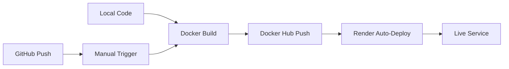

# Docker Deployment Pipeline - PeteRental VAPI

## 🚀 Deployment Overview

The PeteRental VAPI system uses a **Docker Hub → Render** deployment pipeline with automated builds and fast serverless scaling.

## 🏗️ Build Pipeline

### Local Development
```bash
# 1. Install dependencies with uv (following rules)
uv sync

# 2. Test locally 
uv run uvicorn main:app --reload --port 8000

# 3. Test database functionality
uv run python -c "from rental_database import rental_db; print(rental_db.get_database_stats())"
```

### Docker Build Process
```bash
# Build locally with proper tag
docker build -t mark0025/peterentalvapi:latest .

# Tag for versioning
docker tag mark0025/peterentalvapi:latest mark0025/peterentalvapi:v1.0.0

# Push to Docker Hub
docker push mark0025/peterentalvapi:latest
docker push mark0025/peterentalvapi:v1.0.0
```

### Automated Build Script
```bash
#!/bin/bash
# docker_hub_deploy.sh

set -e

VERSION=${1:-latest}
IMAGE_NAME="mark0025/peterentalvapi"

echo "🐳 Building Docker image..."
docker build -t $IMAGE_NAME:$VERSION .

echo "🏷️ Tagging image..."  
docker tag $IMAGE_NAME:$VERSION $IMAGE_NAME:latest

echo "📤 Pushing to Docker Hub..."
docker push $IMAGE_NAME:$VERSION
docker push $IMAGE_NAME:latest

echo "✅ Deployment complete: $IMAGE_NAME:$VERSION"
```

## 🐳 Docker Image Analysis

### Multi-Stage Build
```dockerfile
# Stage 1: Base with Playwright browsers (2.5GB)
FROM mcr.microsoft.com/playwright:v1.54.0-noble

# Stage 2: Python environment setup
RUN apt-get update && apt-get install -y \
    python3.12 python3.12-venv pipx

# Stage 3: Package manager installation (uv)
RUN pipx install uv && pipx ensurepath
ENV PATH="/root/.local/bin:$PATH"

# Stage 4: Dependency installation
WORKDIR /app
COPY pyproject.toml uv.lock ./
RUN uv sync --frozen

# Stage 5: Application code
COPY . .

# Stage 6: Security & execution
RUN useradd -m appuser && chown -R appuser:appuser /app
USER appuser

EXPOSE 8000
CMD ["uv", "run", "uvicorn", "main:app", "--host", "0.0.0.0", "--port", "8000"]
```

### Image Layers & Sizes
```
Layer 1: Playwright Base      ~2.5GB  (browsers + Ubuntu Noble)
Layer 2: Python + System     ~200MB   (Python 3.12 + dev tools)
Layer 3: uv Package Manager  ~50MB    (pipx + uv installation)
Layer 4: Dependencies        ~100MB   (FastAPI + scraping libs)
Layer 5: Application Code     ~1MB    (Python files + JSON DB)
Layer 6: Security Config     ~1MB    (user setup + permissions)
---
Total: ~2.85GB compressed
```

### File Inclusion Analysis
**Included in Container:**
```
✅ main.py                     # FastAPI webhook server
✅ rental_database.py          # JSON database operations  
✅ rental_data.json           # 4 cached rental properties
✅ langchain_rental_scraper.py # OpenRouter AI scraper
✅ playwright_scraper.py       # Browser automation
✅ pyproject.toml + uv.lock   # Dependency definitions
✅ Dockerfile + docker-compose.yml
```

**Excluded via .dockerignore:**
```
❌ .venv/                     # Local virtual environment
❌ __pycache__/               # Python bytecode
❌ .git/                      # Git repository
❌ *.md (except README.md)    # Documentation files
❌ .env                       # Local environment variables
```

## ☁️ Render Deployment

### render.yaml Configuration
```yaml
services:
  - type: web
    name: peterental-vapi
    plan: starter              # $7/month plan
    image:
      url: docker.io/mark0025/peterentalvapi:latest
    envVars:
      - key: OPENROUTER_API_KEY
        sync: false           # Set manually in dashboard
      - key: PORT
        value: 8000
    healthCheckPath: /health
    autoDeploy: true          # Redeploy on Docker Hub push
```

### Deployment Flow


### Environment Variables
**Render Dashboard Config:**
```
OPENROUTER_API_KEY: sk-or-v1-xxx...  (Secret)
PORT: 8000                           (Auto-set)
```

**Container Runtime:**
```bash
# These are available inside the container
echo $OPENROUTER_API_KEY  # For LangChain scraper
echo $PORT               # For uvicorn server
```

## 📊 Resource Usage & Scaling

### Container Specs
```
CPU: 0.5 vCPU (shared)
RAM: 512MB (expandable to 1GB burst)
Storage: 10GB ephemeral disk
Network: 100GB bandwidth/month
```

### Performance Profiles
**Cold Start**: ~15-30 seconds (downloading 2.8GB image)
**Warm Response**: <1 second (database lookup)
**Scraping Response**: 5-10 seconds (live data extraction)
**Memory Usage**: 150-600MB depending on activity

### Auto-Scaling Behavior
```
Idle: 1 instance (always-on with Starter plan)
Load: Render automatically scales horizontally
Max: Limited by plan (1 instance on Starter)
```

## 🔧 Volume & Data Persistence

### Database Storage
**Current**: `rental_data.json` embedded in container image
```bash
# Data location inside container
/app/rental_data.json  (read-write for updates)
```

**Limitations**: 
- Data resets on container restart
- Updates don't persist between deployments  
- Database changes require new Docker build

**Future Enhancement**: External volume for persistent database
```yaml
# Potential render.yaml addition
volumes:
  - name: rental-data
    mountPath: /app/data
    size: 1GB
```

## 🚨 Deployment Verification

### Health Checks
```bash
# Render automatic health check
curl https://peterentalvapi-latest.onrender.com/health

# Expected response
{
  "status": "healthy",
  "service": "peterental-vapi"
}
```

### Full System Test
```bash
# 1. Service availability
curl https://peterentalvapi-latest.onrender.com/

# 2. Database connectivity  
curl https://peterentalvapi-latest.onrender.com/database/status

# 3. Webhook functionality
curl -X POST https://peterentalvapi-latest.onrender.com/vapi/webhook \
  -H "Content-Type: application/json" \
  -d '{"website": "test.com"}'
```

### Container Inspection
```bash
# Pull and inspect deployed image
docker pull mark0025/peterentalvapi:latest
docker image inspect mark0025/peterentalvapi:latest

# Check image contents
docker run --rm -it mark0025/peterentalvapi:latest /bin/bash
ls -la /app/
cat /app/rental_data.json | jq .
```

## 🔄 Update & Rollback Process

### Standard Update
```bash
# 1. Make code changes locally
# 2. Test changes with uv run uvicorn main:app --reload
# 3. Build new image
docker build -t mark0025/peterentalvapi:v1.0.1 .

# 4. Push to trigger auto-deploy
docker push mark0025/peterentalvapi:latest
docker push mark0025/peterentalvapi:v1.0.1

# 5. Render auto-deploys within 2-3 minutes
# 6. Verify deployment
curl https://peterentalvapi-latest.onrender.com/health
```

### Emergency Rollback
```bash
# 1. Identify last working version
docker images mark0025/peterentalvapi

# 2. Re-tag previous version as latest
docker tag mark0025/peterentalvapi:v1.0.0 mark0025/peterentalvapi:latest
docker push mark0025/peterentalvapi:latest

# 3. Render will auto-deploy rollback
# 4. Verify service restoration
```

## 🔮 MCP & Serverless Integration Points

### Future MCP Server Integration
```yaml
# Potential MCP service addition
- type: web
  name: peterental-mcp-server  
  image:
    url: docker.io/mark0025/peterental-mcp:latest
  envVars:
    - key: MCP_PORT
      value: 3000
```

### Serverless Migration Path
**Current**: Always-on container (Render Web Service)  
**Future**: Function-based (Render Background Jobs)

```python
# Serverless handler structure
def handle_vapi_request(event):
    website = extract_website_from_event(event)
    rentals = query_database(website)
    return format_response(rentals)
```

## 📈 Monitoring & Logs

### Built-in Monitoring
- **Render Dashboard**: Response times, error rates, resource usage
- **Container Logs**: Application logs via `uvicorn` and `loguru`
- **Health Checks**: Automated `/health` endpoint monitoring

### Log Access
```bash
# View live logs (Render Dashboard)
# Or via CLI if render-cli is available
render logs peterental-vapi --tail

# Log format
2025-08-28 17:15:56 | INFO | Database has 4 rentals
2025-08-28 17:15:57 | INFO | VAPI webhook received request
```

---

## 🎯 Summary

**Current State**: Docker Hub → Render pipeline with 4 rental properties in embedded database

**Strengths**: Simple, fast deployment with auto-scaling

**Optimization Opportunities**: 
1. Fix VAPI payload parsing
2. Add persistent database volume  
3. Consider MCP integration
4. Implement proper CI/CD with testing

**Goal**: Maintain simple, reliable deployment while adding database-first response logic for optimal VAPI performance.
