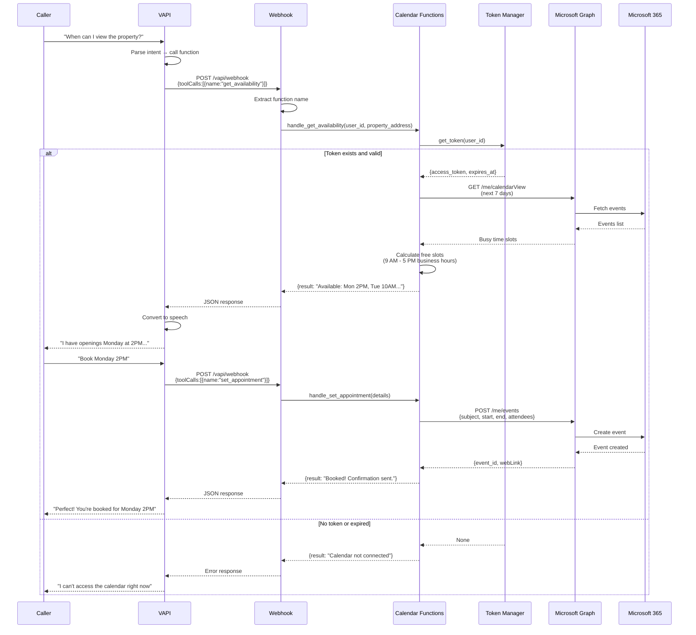
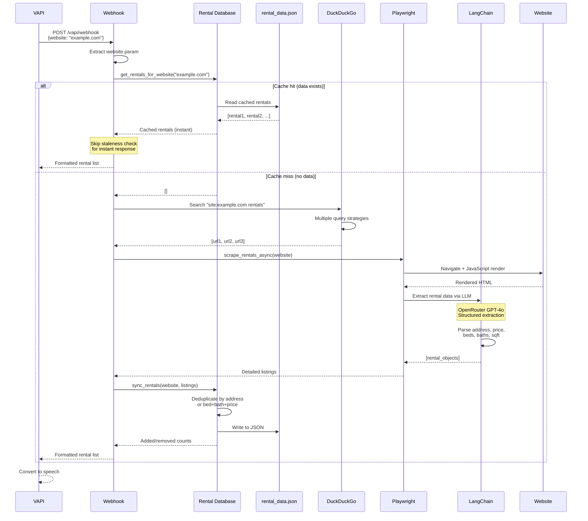
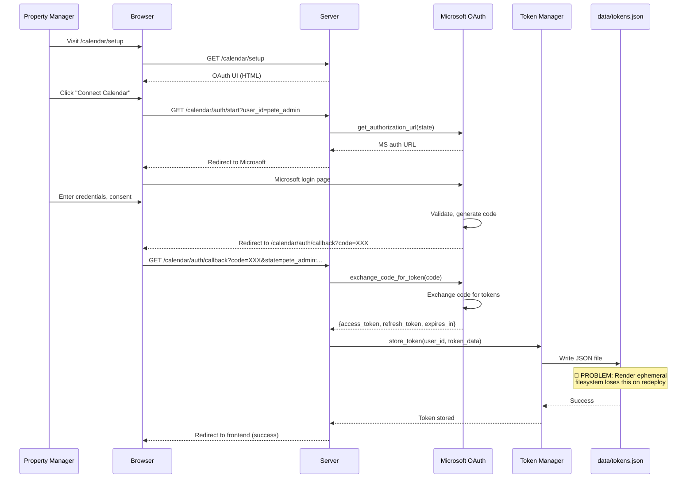
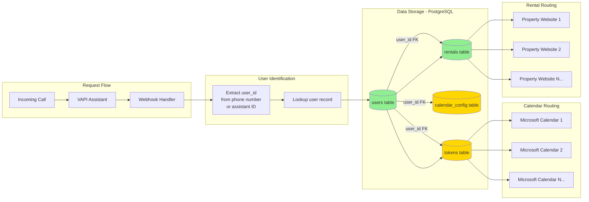

# PeteRental VAPI - Master Project Architecture

**Status Legend:**
- 🟢 **GREEN** - Working in production
- 🟡 **YELLOW** - Partially working / needs verification
- 🔴 **RED** - Broken / not configured
- ⚪ **WHITE** - Not applicable / informational

---

## 🎯 SYSTEM OVERVIEW

**Purpose:** Voice AI assistant for rental property management that:
1. Searches property management websites for available rentals
2. Checks property manager's calendar for viewing availability
3. Books property viewing appointments via voice

**Scale Target:**
- **Current:** 1 property manager (pete_admin)
- **Design:** Supports 1-20,000+ property managers
- **Architecture:** Multi-tenant with user_id routing

---

## 🏗️ COMPLETE SYSTEM ARCHITECTURE

```mermaid
graph TB
    subgraph "External Systems"
        CALLER[📞 Phone Caller]
        VAPI[🤖 VAPI Voice AI Platform]
        MSFT[☁️ Microsoft Graph API]
        WEB[🌐 Property Websites]
    end

    subgraph "Production Server - Render.com"
        subgraph "FastAPI Server - main.py:1058 lines"
            ROOT[🏠 GET / - Server Info]
            HEALTH[💚 GET /health - Health Check]
            WEBHOOK[🎣 POST /vapi/webhook - Main Handler]

            subgraph "Webhook Router Logic"
                EXTRACT[Extract Function Call]
                ROUTE{Route by Function}

                ROUTE -->|get_availability| CAL_GET[Calendar: Get Slots]
                ROUTE -->|set_appointment| CAL_SET[Calendar: Book Appointment]
                ROUTE -->|website param| WEB_SEARCH[Website: Search Rentals]
            end

            subgraph "Calendar Endpoints"
                CAL_SETUP[🔐 GET /calendar/setup - OAuth UI]
                CAL_START[▶️ GET /calendar/auth/start - Start OAuth]
                CAL_CALLBACK[◀️ GET /calendar/auth/callback - OAuth Return]
                CAL_STATUS[✅ GET /calendar/auth/status - Check Token]
                CAL_AVAIL[📅 GET /calendar/availability - Direct API]
                CAL_CREATE[📝 POST /calendar/events - Direct API]
                CAL_LIST[📋 GET /calendar/events - List Events]
            end

            subgraph "Database Endpoints"
                DB_STATUS[📊 GET /database/status - Stats]
                DB_RENTALS[🏘️ GET /database/rentals/{website}]
                DB_AVAILABLE[🔓 GET /database/available - All Available]
            end

            subgraph "VAPI Admin"
                VAPI_ASSIST[👥 GET /vapi/assistants - List Assistants]
            end
        end

        subgraph "Core Services"
            subgraph "Calendar Module - src/calendar/"
                OAUTH[microsoft_oauth.py<br/>OAuth Flow Handler]
                MSGRAPH[microsoft_calendar.py<br/>Graph API Client]
                TOKENS[token_manager.py<br/>Token Storage]
                CAL_FUNC[../vapi/functions/calendar_functions.py<br/>VAPI Function Handlers]
            end

            subgraph "Rental Search Pipeline"
                DDGS[DuckDuckGo Search<br/>ddgs library]
                PLAYWRIGHT[playwright_scraper.py<br/>Browser Automation]
                LANGCHAIN[langchain_rental_scraper.py<br/>LLM Data Extraction]
            end

            subgraph "Data Layer"
                RENTALDB[rental_database.py<br/>JSON Storage + Dedup]
                RENTALDATA[(data/rental_data.json<br/>Cached Rentals)]
                TOKENDATA[(data/tokens.json<br/>OAuth Tokens)]
            end
        end

        WEBHOOK --> EXTRACT
        EXTRACT --> ROUTE

        CAL_GET --> CAL_FUNC
        CAL_SET --> CAL_FUNC
        CAL_FUNC --> TOKENS
        CAL_FUNC --> MSGRAPH

        WEB_SEARCH --> RENTALDB
        RENTALDB --> RENTALDATA
        WEB_SEARCH --> DDGS
        DDGS --> PLAYWRIGHT
        PLAYWRIGHT --> LANGCHAIN
        LANGCHAIN --> RENTALDB

        CAL_START --> OAUTH
        CAL_CALLBACK --> OAUTH
        OAUTH --> TOKENS
        TOKENS --> TOKENDATA

        CAL_AVAIL --> MSGRAPH
        CAL_CREATE --> MSGRAPH
        CAL_LIST --> MSGRAPH
        MSGRAPH --> MSFT
    end

    subgraph "External Data Flow"
        CALLER -->|Voice Call| VAPI
        VAPI -->|HTTP POST| WEBHOOK
        WEBHOOK -->|JSON Response| VAPI
        VAPI -->|Voice Response| CALLER

        OAUTH -->|Redirect| MSFT
        MSFT -->|Code| CAL_CALLBACK

        DDGS -->|Search| WEB
        PLAYWRIGHT -->|Scrape| WEB
    end

    subgraph "Local Development"
        NGROK[🔗 ngrok Tunnel<br/>start_dev.sh]
        LOCALSERVER[💻 localhost:8001<br/>Hot Reload]

        NGROK --> LOCALSERVER
    end

    style ROOT fill:#90EE90
    style HEALTH fill:#90EE90
    style WEBHOOK fill:#90EE90
    style WEB_SEARCH fill:#90EE90
    style RENTALDB fill:#90EE90
    style DDGS fill:#90EE90
    style PLAYWRIGHT fill:#90EE90
    style LANGCHAIN fill:#90EE90
    style RENTALDATA fill:#90EE90

    style CAL_FUNC fill:#FFD700
    style CAL_GET fill:#FFD700
    style CAL_SET fill:#FFD700
    style TOKENS fill:#FFD700
    style TOKENDATA fill:#FFD700
    style OAUTH fill:#FFD700
    style MSGRAPH fill:#FFD700

    style CAL_SETUP fill:#FF6B6B
    style CAL_START fill:#FF6B6B
    style CAL_CALLBACK fill:#FF6B6B
    style CAL_STATUS fill:#FF6B6B
    style CAL_AVAIL fill:#FF6B6B
    style CAL_CREATE fill:#FF6B6B
    style CAL_LIST fill:#FF6B6B
```

---

## 📊 COMPONENT STATUS MATRIX

### Production Endpoints (Render: peterentalvapi-latest.onrender.com)

| Endpoint | Status | Function | Notes |
|----------|--------|----------|-------|
| `GET /` | 🟢 | Server info | Returns version, features |
| `GET /health` | 🟢 | Health check | Render monitoring |
| `POST /vapi/webhook` | 🟢 | Main webhook | Handles all VAPI calls |
| `GET /calendar/setup` | 🔴 | OAuth UI | Needs production auth |
| `GET /calendar/auth/start` | 🔴 | Start OAuth | Not authorized |
| `GET /calendar/auth/callback` | 🔴 | OAuth callback | Not authorized |
| `GET /calendar/auth/status` | 🔴 | Check token | Returns false |
| `GET /calendar/availability` | 🔴 | Get slots | No token |
| `POST /calendar/events` | 🔴 | Create event | No token |
| `GET /calendar/events` | 🔴 | List events | No token |
| `GET /database/status` | 🟢 | DB stats | Working |
| `GET /database/rentals/{website}` | 🟢 | Rentals by site | Working |
| `GET /database/available` | 🟢 | All rentals | Working |
| `GET /vapi/assistants` | 🟡 | List assistants | Requires VAPI_API_KEY |

### Core Services

| Service | File | Lines | Status | Function |
|---------|------|-------|--------|----------|
| **FastAPI Server** | main.py | 1058 | 🟢 | HTTP server, routing |
| **Webhook Handler** | main.py:721-1052 | 331 | 🟢 | VAPI webhook logic |
| **Rental Database** | rental_database.py | 290 | 🟢 | JSON storage, dedup |
| **LangChain Scraper** | langchain_rental_scraper.py | 500 | 🟢 | LLM extraction |
| **Playwright Scraper** | playwright_scraper.py | 450 | 🟢 | Browser automation |
| **Calendar Functions** | src/vapi/functions/calendar_functions.py | ~200 | 🟡 | Works locally only |
| **Microsoft OAuth** | src/calendar/microsoft_oauth.py | ~150 | 🟡 | Works locally only |
| **Microsoft Calendar** | src/calendar/microsoft_calendar.py | ~200 | 🟡 | Works locally only |
| **Token Manager** | src/calendar/token_manager.py | ~100 | 🔴 | File-based (ephemeral) |

### Data Storage

| Store | Type | Status | Persistence | Notes |
|-------|------|--------|-------------|-------|
| `data/rental_data.json` | JSON | 🟢 | Ephemeral | Lost on redeploy |
| `data/tokens.json` | JSON | 🔴 | Ephemeral | **BLOCKER** for production |
| Environment Variables | .env | 🟢 | Permanent | OPENROUTER_API_KEY set |

---

## 🔄 DATA FLOW SEQUENCES

### Sequence 1: Voice Caller Books Appointment (END-TO-END)



**Status:** 🟡 Works locally, 🔴 Broken on production (no token)

---

### Sequence 2: Search for Rentals on Website



**Status:** 🟢 Fully working in production

---

### Sequence 3: OAuth Authorization Flow (BROKEN ON PROD)



**Status:** 🔴 **CRITICAL BLOCKER**
- Works locally ✅
- Breaks on production ❌ (ephemeral filesystem)
- **Fix Required:** PostgreSQL or Redis token storage

---

## 🏢 MULTI-TENANT ARCHITECTURE

### Current: 1 Property Manager
```
user_id: "pete_admin"
├── Token: data/tokens.json["pete_admin"]
└── Calendar: Microsoft 365 account
```

### Scale: 20,000 Property Managers



### Database Schema (Scalable Design)

```sql
-- Users table (20,000 rows)
CREATE TABLE users (
    user_id VARCHAR(255) PRIMARY KEY,  -- "pete_admin", "john_doe", etc.
    email VARCHAR(255) UNIQUE NOT NULL,
    phone VARCHAR(50),
    created_at TIMESTAMP DEFAULT NOW(),
    is_active BOOLEAN DEFAULT TRUE
);

-- OAuth tokens table (20,000 rows)
CREATE TABLE oauth_tokens (
    id SERIAL PRIMARY KEY,
    user_id VARCHAR(255) REFERENCES users(user_id),
    provider VARCHAR(50),  -- "microsoft", "google"
    access_token TEXT NOT NULL,
    refresh_token TEXT,
    expires_at TIMESTAMP,
    created_at TIMESTAMP DEFAULT NOW(),
    updated_at TIMESTAMP DEFAULT NOW(),
    UNIQUE(user_id, provider)
);

-- Calendar configuration
CREATE TABLE calendar_config (
    user_id VARCHAR(255) REFERENCES users(user_id),
    business_hours_start INTEGER DEFAULT 9,  -- 9 AM
    business_hours_end INTEGER DEFAULT 17,   -- 5 PM
    timezone VARCHAR(50) DEFAULT 'America/New_York',
    booking_buffer_minutes INTEGER DEFAULT 30,
    PRIMARY KEY(user_id)
);

-- Rentals cache (millions of rows potential)
CREATE TABLE rentals (
    id SERIAL PRIMARY KEY,
    user_id VARCHAR(255) REFERENCES users(user_id),
    website VARCHAR(500),
    address VARCHAR(500),
    price DECIMAL(10,2),
    bedrooms DECIMAL(3,1),
    bathrooms DECIMAL(3,1),
    square_feet INTEGER,
    property_type VARCHAR(100),
    available_date VARCHAR(100),
    scraped_at TIMESTAMP DEFAULT NOW(),
    INDEX idx_user_website (user_id, website),
    INDEX idx_address (address),
    UNIQUE(user_id, website, address)  -- Deduplication
);
```

### Code Changes Required for Scale

**Current (1 user):**
```python
# main.py:756
user_id = request.get('user_id', 'pete_admin')  # Hardcoded default
token_data = token_manager.get_token(user_id)  # File-based
```

**Scaled (20,000 users):**
```python
# main.py (modified)
async def get_user_from_call(call_metadata):
    """Extract user_id from VAPI call metadata"""
    phone_number = call_metadata.get('from')
    assistant_id = call_metadata.get('assistant_id')

    # Lookup in database
    user = await db.users.find_one({
        '$or': [
            {'phone': phone_number},
            {'assistant_id': assistant_id}
        ]
    })
    return user['user_id'] if user else None

# In webhook handler
user_id = await get_user_from_call(request.get('call', {}))
if not user_id:
    return {"error": "User not found"}

# PostgreSQL token storage
token_data = await db.query(
    "SELECT * FROM oauth_tokens WHERE user_id = $1 AND provider = 'microsoft'",
    user_id
)
```

**Status:** 🟡 Architecture supports multi-tenant, needs DB migration

---

## 📦 FILE STRUCTURE (Current State)

### 🟢 CORE FILES (KEEP)
```
PeteRental_vapi_10_02_25/
├── main.py                         [1058 lines] 🟢 FastAPI server
├── rental_database.py              [290 lines]  🟢 JSON storage
├── langchain_rental_scraper.py     [500 lines]  🟢 LLM scraper
├── playwright_scraper.py           [450 lines]  🟢 Browser automation
│
├── src/
│   ├── calendar/                   🟡 Works locally
│   │   ├── microsoft_oauth.py      [150 lines]  OAuth handler
│   │   ├── microsoft_calendar.py   [200 lines]  Graph API client
│   │   └── token_manager.py        [100 lines]  🔴 File-based (ephemeral)
│   └── vapi/
│       └── functions/
│           └── calendar_functions.py [200 lines] 🟡 Calendar handlers
│
├── data/                           🟡 Ephemeral storage
│   ├── rental_data.json            2.5KB - Rental cache
│   └── tokens.json                 Generated - OAuth tokens
│
├── .env                            🟢 Secrets (OPENROUTER_API_KEY)
├── Dockerfile                      🟢 Container config
├── render.yaml                     🟢 Deployment config
├── pyproject.toml                  🟢 Dependencies
└── start_dev.sh                    🟢 Local dev script
```

### 🔴 BLOAT FILES (MOVE TO _deprecated/)

#### Fix/Debug Scripts (8 files - 20.8KB)
```
├── fix_vapi_response.py            [2.2KB] One-off fix
├── fix_vapi_template_final.py      [2.6KB] Template debugging
├── fix_for_current_production.py   [2.5KB] Production hotfix
├── check_vapi_calls.py             [1.5KB] Debug logging
├── check_assistant_config.py       [1.9KB] Config verification
├── verify_vapi_config.py           [1.1KB] Config check
├── update_vapi_user.py             [3.6KB] User config script
└── create_vapi_functions.py        [4.6KB] Manual function creation
```

#### Assistant Tools (3 files - 9.7KB)
```
├── attach_tools_to_assistant.py    [1.7KB] Old approach
├── attach_tools_final.py           [6.5KB] Iteration
└── (outdated VAPI SDK usage)
```

#### Unused src/ Modules (12 files/dirs)
```
src/
├── vapi/
│   ├── api/
│   │   └── vapi_router.py          [634 lines] 🔴 Different project architecture
│   ├── models/
│   │   └── webhook_models.py       Pydantic models (unused)
│   └── services/
│       └── provider_service.py     LLM provider logic (unused)
├── ai/
│   └── model_manager.py            🔴 Different project
├── config/
│   └── model_settings.py           🔴 Different project
└── utils/
    └── logger.py                   🔴 Using loguru directly
```

#### Test Files (4 files - consolidate)
```
├── test_webhook.py                 [830B]   Basic test
├── test_production_webhook.py      [1.3KB]  Prod test
├── test_calendar_vapi.py           [6.3KB]  Calendar test
└── test_calendar_endpoints.py      [7.6KB]  Endpoint test
```

---

## 🎯 CRITICAL PATH TO WORKING STATE

### Current State Summary
| Component | Local | Production |
|-----------|-------|------------|
| Webhook | 🟢 | 🟢 |
| Rental Search | 🟢 | 🟢 |
| Database | 🟢 | 🟢 |
| Calendar Functions | 🟢 | 🔴 |
| OAuth Flow | 🟢 | 🔴 |
| Token Storage | 🟢 | 🔴 **BLOCKER** |

### Fix Sequence (Priority Order)

#### 1. IMMEDIATE: Clean Project (No Breaking Changes)
```bash
# Create deprecated directory
mkdir _deprecated

# Move bloat (25 files)
mv fix_*.py check_*.py verify_*.py update_*.py create_vapi_*.py attach_*.py _deprecated/
mv src/vapi/api/ src/vapi/models/ src/vapi/services/ _deprecated/
mv src/ai/ src/config/ src/utils/ _deprecated/
```

**Impact:** ✅ No functionality change, cleaner codebase

---

#### 2. CRITICAL: Fix Token Storage (Production Blocker)

**Option A: Quick Fix (PostgreSQL on Render)**
```bash
# Add PostgreSQL addon in Render dashboard
# Update token_manager.py to use PostgreSQL

# Modified token_manager.py
import asyncpg

class TokenManager:
    def __init__(self, db_url):
        self.db_url = db_url

    async def store_token(self, user_id, token_data):
        conn = await asyncpg.connect(self.db_url)
        await conn.execute('''
            INSERT INTO oauth_tokens (user_id, provider, access_token, refresh_token, expires_at)
            VALUES ($1, 'microsoft', $2, $3, $4)
            ON CONFLICT (user_id, provider)
            DO UPDATE SET access_token = $2, refresh_token = $3, expires_at = $4
        ''', user_id, token_data['access_token'],
             token_data['refresh_token'], token_data['expires_at'])
        await conn.close()
```

**Impact:** 🟢 Tokens persist across redeploys

**Option B: Redis (Simpler)**
```python
import redis
import json

class TokenManager:
    def __init__(self, redis_url):
        self.redis = redis.from_url(redis_url)

    def store_token(self, user_id, token_data):
        key = f"token:{user_id}:microsoft"
        self.redis.setex(key, 3600*24*30, json.dumps(token_data))  # 30 day TTL
```

**Impact:** 🟢 Simpler, tokens persist

---

#### 3. HIGH: Authorize Production Calendar
```bash
# After fixing token storage:
1. Visit https://peterentalvapi-latest.onrender.com/calendar/setup
2. Click "Connect Microsoft Calendar"
3. Login with Microsoft account
4. Token now persists in PostgreSQL/Redis
```

**Impact:** 🟢 Calendar functions work in production

---

#### 4. MEDIUM: Update VAPI Dashboard
```yaml
Assistant Configuration:
  Functions:
    - name: get_availability
      url: https://peterentalvapi-latest.onrender.com/vapi/webhook
      method: POST

    - name: set_appointment
      url: https://peterentalvapi-latest.onrender.com/vapi/webhook
      method: POST

  Prompt: |
    You help people find and book rental property viewings.
    Use get_availability to check open times.
    Use set_appointment to book viewings.
```

**Impact:** 🟢 Full end-to-end voice booking

---

#### 5. SCALE: Multi-Tenant Database Migration
```bash
# When scaling to 20K users:
1. Add PostgreSQL database (already needed for tokens)
2. Migrate rental_data.json → PostgreSQL rentals table
3. Add user_id routing in webhook handler
4. Add phone→user_id lookup
```

**Impact:** 🟢 Supports 1-20,000+ users

---

## 🔍 VERIFICATION CHECKLIST

### Local Development ✅
- [x] Server starts: `./start_dev.sh`
- [x] Webhook responds: `curl localhost:8001/vapi/webhook`
- [x] Rental search works
- [x] Calendar authorized
- [x] Calendar functions work

### Production 🟡
- [x] Server healthy: `curl https://peterentalvapi-latest.onrender.com/health`
- [x] Webhook responds
- [x] Rental search works
- [ ] Calendar authorized 🔴 **BLOCKER**
- [ ] Calendar functions work 🔴 **BLOCKED**

### VAPI Integration ❓
- [ ] Assistants configured (need dashboard access)
- [ ] Functions attached
- [ ] Test call successful

---

## 📝 DEPENDENCIES

### Python Packages (pyproject.toml)
```toml
[project]
dependencies = [
    "fastapi>=0.104.0",           # 🟢 Web framework
    "uvicorn>=0.24.0",            # 🟢 ASGI server
    "langchain>=0.1.0",           # 🟢 LLM framework
    "playwright>=1.40.0",         # 🟢 Browser automation
    "duckduckgo-search>=4.0.0",   # 🟢 Web search
    "httpx>=0.25.0",              # 🟢 Async HTTP
    "loguru>=0.7.0",              # 🟢 Logging
    "python-dotenv>=1.0.0",       # 🟢 Env vars
    "beautifulsoup4>=4.12.0",     # 🟢 HTML parsing
]

[project.optional-dependencies]
dev = [
    "pytest>=7.4.0",
    "pytest-asyncio>=0.21.0",
]
```

### External Services
| Service | Purpose | Status |
|---------|---------|--------|
| **OpenRouter** | LLM API (GPT-4o) | 🟢 Configured |
| **Microsoft Graph** | Calendar API | 🟡 Local only |
| **VAPI** | Voice AI platform | 🟡 Webhook ready |
| **Render** | Hosting | 🟢 Deployed |
| **PostgreSQL** | Token storage | 🔴 **NEEDED** |

---

## 🚀 DEPLOYMENT URLS

### Production
- **Service:** `peterental-vapi` (Render service name)
- **URL:** `https://peterentalvapi-latest.onrender.com`
- **Health:** https://peterentalvapi-latest.onrender.com/health 🟢
- **Webhook:** https://peterentalvapi-latest.onrender.com/vapi/webhook 🟢
- **Docs:** https://peterentalvapi-latest.onrender.com/docs 🟢

### Local Dev
- **Server:** `http://localhost:8001`
- **Ngrok:** `./start_dev.sh` auto-generates tunnel

---

## 🎓 ARCHITECTURAL DECISIONS

### Why JSON Storage?
- ✅ Simple for MVP
- ✅ No database setup initially
- ❌ Not scalable past 10K rentals
- ❌ Ephemeral on Render

**Decision:** Migrate to PostgreSQL when scaling OR move to Render persistent disk

### Why File-Based Tokens?
- ✅ Simple for single user
- ❌ **BLOCKER:** Ephemeral filesystem

**Decision:** **MUST** migrate to PostgreSQL/Redis for production

### Why LangChain + OpenRouter?
- ✅ Flexible LLM extraction (handles any website structure)
- ✅ Better than regex parsing
- ❌ Costs $0.001-0.01 per scrape

**Decision:** Keep for accuracy, monitor costs

---

**END OF MASTER ARCHITECTURE DOCUMENT**

Next Action: Move bloat files to `_deprecated/` directory
